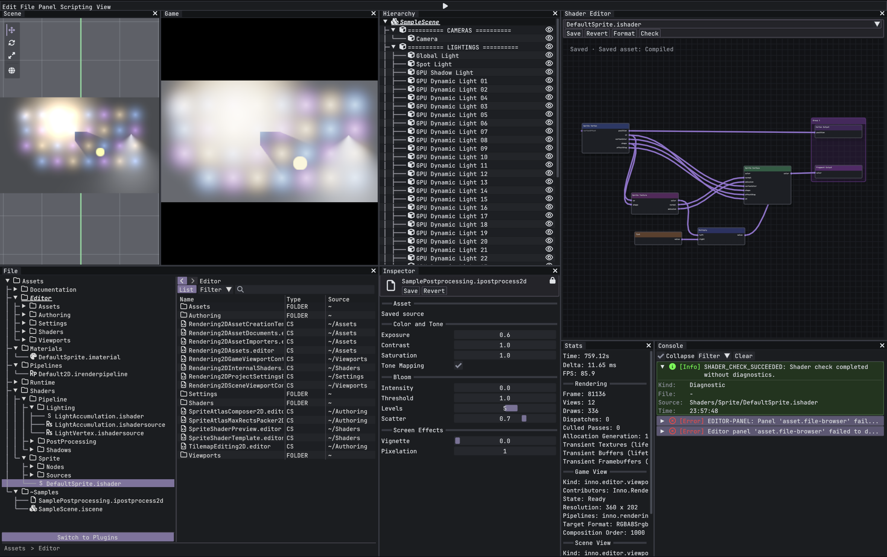

# InnoEngine (WIP)

A work-in-progress cross-platform game engine written in C#.

---

## Overview

**InnoEngine** is a personal learning project focused on building a clean, modular, and practical engine architecture from the ground up. The long-term goal is not just to render things on screen, but to explore how an engine should be structured: runtime, asset pipeline, rendering abstraction, editor tooling, scene/prefab workflow, and cross-platform support.
If you think the engine interesting and want to support this repo, please ⭐️ star this project, thank you!



This project is still evolving quickly, and many parts are being redesigned as the engine grows. That is:
> I am **NOT** trying to ship a finished engine overnight.  
> I do **NOT** guarantee any backward compatibility between versions.
---

## Design goals

A few principles I want to keep pushing toward:

- **modular** — systems should have clear responsibilities and boundaries
- **practical** — architecture should support real workflows, not just toy demos
- **inspectable** — editor and tooling matter as much as runtime code
- **cross-platform** — no platform should be treated as an afterthought
- **extensible** — adding new backends, tools, or content types should feel natural
- **clean** — readable code and maintainable project structure over clever shortcuts

---

## Repository layout

The repository is split into several major areas such as engine/runtime code, editor code, tools, samples, tests, native interop, and documentation. The following is an example of an **IDEAL** repo structure. This will **NOT** be exactly the same as the real one.

```
Inno/
├─ global.json
├─ Directory.Build.props
├─ Directory.Packages.props
├─ NuGet.config
├─ .editorconfig
├─ .gitignore
├─ README.md
├─ LICENSE
│
├─ build/
│  ├─ Build.cs
│  ├─ build.ps1
│  ├─ build.sh
│  ├─ clean.ps1
│  ├─ clean.sh
│  ├─ pack.ps1
│  ├─ pack.sh
│  └─ targets/
│     ├─ common.props
│     ├─ managed.props
│     ├─ native.props
│     ├─ tests.props
│     ├─ editor.props
│     ├─ packaging.props
│     └─ publish.props
│
├─ docs/
│  ├─ architecture/
│  │  ├─ overview.md
│  │  ├─ dependency-rules.md
│  │  ├─ runtime-loop.md
│  │  ├─ asset-pipeline.md
│  │  ├─ graphics-abstraction.md
│  │  ├─ editor-architecture.md
│  │  ├─ scene-and-prefab.md
│  │  └─ serialization.md
│  ├─ guides/
│  │  ├─ getting-started.md
│  │  ├─ create-a-game-project.md
│  │  ├─ build-editor.md
│  │  ├─ build-runtime.md
│  │  ├─ add-a-render-backend.md
│  │  ├─ import-assets.md
│  │  ├─ packaging-a-game.md
│  │  └─ writing-editor-extensions.md
│  ├─ api/
│  └─ diagrams/
│
├─ extern/
│  ├─ SDL3/
│  │  ├─ include/
│  │  ├─ lib/
│  │  ├─ runtimes/
│  │  ├─ tools/
│  │  └─ licenses/
│  ├─ bgfx/
│  │  ├─ include/
│  │  ├─ lib/
│  │  ├─ tools/
│  │  ├─ runtimes/
│  │  └─ licenses/
│  ├─ imgui/
│  │  ├─ include/
│  │  ├─ src/
│  │  └─ licenses/
│  ├─ stb/
│  │  ├─ include/
│  │  └─ licenses/
│  ├─ yaml/
│  │  ├─ include/
│  │  └─ licenses/
│  └─ other/
│
├─ native/
│  ├─ Inno.Native.Common/
│  │  ├─ include/
│  │  │  ├─ inno_common.h
│  │  │  ├─ inno_export.h
│  │  │  └─ inno_platform.h
│  │  ├─ src/
│  │  │  ├─ inno_common.cpp
│  │  │  └─ inno_platform.cpp
│  │  ├─ CMakeLists.txt
│  │  └─ README.md
│  │
│  ├─ Inno.Native.Windowing/
│  │  ├─ include/
│  │  │  ├─ inno_windowing.h
│  │  │  ├─ inno_input.h
│  │  │  └─ inno_clipboard.h
│  │  ├─ src/
│  │  │  ├─ inno_windowing.cpp
│  │  │  ├─ inno_input.cpp
│  │  │  └─ inno_clipboard.cpp
│  │  ├─ CMakeLists.txt
│  │  └─ README.md
│  │
│  ├─ Inno.Native.Graphics/
│  │  ├─ include/
│  │  │  ├─ inno_graphics.h
│  │  │  ├─ inno_graphics_device.h
│  │  │  ├─ inno_graphics_buffer.h
│  │  │  ├─ inno_graphics_texture.h
│  │  │  ├─ inno_graphics_shader.h
│  │  │  └─ inno_graphics_swapchain.h
│  │  ├─ src/
│  │  │  ├─ inno_graphics.cpp
│  │  │  ├─ inno_graphics_device.cpp
│  │  │  ├─ inno_graphics_buffer.cpp
│  │  │  ├─ inno_graphics_texture.cpp
│  │  │  ├─ inno_graphics_shader.cpp
│  │  │  └─ inno_graphics_swapchain.cpp
│  │  ├─ CMakeLists.txt
│  │  └─ README.md
│  │
│  ├─ Inno.Native.Editor/
│  │  ├─ include/
│  │  │  ├─ inno_imgui_bridge.h
│  │  │  └─ inno_editor_bridge.h
│  │  ├─ src/
│  │  │  ├─ inno_imgui_bridge.cpp
│  │  │  └─ inno_editor_bridge.cpp
│  │  ├─ CMakeLists.txt
│  │  └─ README.md
│  │
│  └─ Inno.Native.Generated/
│     ├─ headers/
│     ├─ bindings/
│     └─ scripts/
│
├─ tools/
│  ├─ Inno.Tools.Build/
│  │  ├─ Inno.Tools.Build.csproj
│  │  ├─ Program.cs
│  │  ├─ Commands/
│  │  └─ Services/
│  │
│  ├─ Inno.Tools.ShaderCompiler/
│  │  ├─ Inno.Tools.ShaderCompiler.csproj
│  │  ├─ Program.cs
│  │  ├─ Compiler/
│  │  ├─ Reflection/
│  │  └─ Profiles/
│  │
│  ├─ Inno.Tools.AssetImporter/
│  │  ├─ Inno.Tools.AssetImporter.csproj
│  │  ├─ Program.cs
│  │  ├─ Importers/
│  │  ├─ Pipeline/
│  │  └─ Metadata/
│  │
│  ├─ Inno.Tools.ProjectGen/
│  │  ├─ Inno.Tools.ProjectGen.csproj
│  │  ├─ Program.cs
│  │  ├─ Templates/
│  │  └─ Commands/
│  │
│  ├─ Inno.Tools.HeaderGen/
│  │  ├─ Inno.Tools.HeaderGen.csproj
│  │  ├─ Program.cs
│  │  ├─ Parsing/
│  │  └─ Emitters/
│  │
│  └─ Inno.Tools.Packager/
│     ├─ Inno.Tools.Packager.csproj
│     ├─ Program.cs
│     ├─ Packaging/
│     ├─ Manifests/
│     └─ Commands/
│
├─ templates/
│  ├─ project/
│  │  ├─ Inno.Game.Template/
│  │  │  ├─ Game/
│  │  │  ├─ Game.Content/
│  │  │  ├─ Game.Editor/
│  │  │  ├─ Assets/
│  │  │  └─ Config/
│  │  └─ Inno.Plugin.Template/
│  │     ├─ Plugin/
│  │     └─ Plugin.Editor/
│  ├─ assets/
│  │  ├─ default-materials/
│  │  ├─ default-shaders/
│  │  ├─ icons/
│  │  └─ fonts/
│  └─ scripts/
│
├─ src/
│  ├─ core/
│  │  ├─ Inno.Core/
│  │  │  ├─ Inno.Core.csproj
│  │  │  ├─ GlobalUsings.cs
│  │  │  ├─ Diagnostics/
│  │  │  │  ├─ Guard.cs
│  │  │  │  ├─ ThrowHelper.cs
│  │  │  │  ├─ Assertion.cs
│  │  │  │  └─ DiagnosticsScope.cs
│  │  │  ├─ Exceptions/
│  │  │  │  ├─ InnoException.cs
│  │  │  │  ├─ AssetException.cs
│  │  │  │  └─ GraphicsException.cs
│  │  │  ├─ Interfaces/
│  │  │  │  ├─ IInitializable.cs
│  │  │  │  ├─ IDisposableEx.cs
│  │  │  │  └─ IDeepCloneable.cs
│  │  │  ├─ Results/
│  │  │  │  ├─ Result.cs
│  │  │  │  ├─ ResultT.cs
│  │  │  │  └─ ErrorInfo.cs
│  │  │  ├─ Utilities/
│  │  │  │  ├─ HashUtility.cs
│  │  │  │  ├─ EnumUtility.cs
│  │  │  │  ├─ StringUtility.cs
│  │  │  │  └─ PathUtility.cs
│  │  │  └─ Internals/
│  │  │
│  │  ├─ Inno.Core.Logging/
│  │  │  ├─ Inno.Core.Logging.csproj
│  │  │  ├─ Abstractions/
│  │  │  │  ├─ ILogger.cs
│  │  │  │  ├─ ILoggerFactory.cs
│  │  │  │  └─ LogLevel.cs
│  │  │  ├─ Default/
│  │  │  │  ├─ ConsoleLogger.cs
│  │  │  │  ├─ FileLogger.cs
│  │  │  │  └─ CompositeLogger.cs
│  │  │  ├─ Formatting/
│  │  │  └─ Sinks/
│  │  │
│  │  ├─ Inno.Core.Collections/
│  │  │  ├─ Inno.Core.Collections.csproj
│  │  │  ├─ Pools/
│  │  │  ├─ SparseSets/
│  │  │  ├─ NativeLike/
│  │  │  └─ Utilities/
│  │  │
│  │  ├─ Inno.Core.Math/
│  │  │  ├─ Inno.Core.Math.csproj
│  │  │  ├─ Scalars/
│  │  │  ├─ Vectors/
│  │  │  ├─ Matrices/
│  │  │  ├─ Geometry/
│  │  │  ├─ Colors/
│  │  │  └─ Transforms/
│  │  │
│  │  ├─ Inno.Core.Memory/
│  │  │  ├─ Inno.Core.Memory.csproj
│  │  │  ├─ Buffers/
│  │  │  ├─ Allocators/
│  │  │  ├─ Handles/
│  │  │  └─ Unsafe/
│  │  │
│  │  ├─ Inno.Core.IO/
│  │  │  ├─ Inno.Core.IO.csproj
│  │  │  ├─ Paths/
│  │  │  ├─ Streams/
│  │  │  ├─ FileSystem/
│  │  │  └─ Watchers/
│  │  │
│  │  ├─ Inno.Core.Serialization/
│  │  │  ├─ Inno.Core.Serialization.csproj
│  │  │  ├─ Abstractions/
│  │  │  ├─ Binary/
│  │  │  ├─ Yaml/
│  │  │  ├─ Json/
│  │  │  ├─ Codecs/
│  │  │  └─ Metadata/
│  │  │
│  │  ├─ Inno.Core.Reflection/
│  │  │  ├─ Inno.Core.Reflection.csproj
│  │  │  ├─ Types/
│  │  │  ├─ Attributes/
│  │  │  ├─ Accessors/
│  │  │  ├─ Metadata/
│  │  │  └─ Caching/
│  │  │
│  │  └─ Inno.Core.Threading/
│  │     ├─ Inno.Core.Threading.csproj
│  │     ├─ Jobs/
│  │     ├─ Scheduling/
│  │     ├─ Synchronization/
│  │     └─ Collections/
│  │
│  ├─ platform/
│  │  ├─ Inno.Platform/
│  │  │  ├─ Inno.Platform.csproj
│  │  │  ├─ Abstractions/
│  │  │  │  ├─ IPlatform.cs
│  │  │  │  ├─ IApplicationPlatform.cs
│  │  │  │  ├─ IWindowPlatform.cs
│  │  │  │  ├─ IInputPlatform.cs
│  │  │  │  └─ IClipboardPlatform.cs
│  │  │  ├─ Application/
│  │  │  ├─ Windowing/
│  │  │  ├─ Input/
│  │  │  ├─ Timing/
│  │  │  ├─ Clipboard/
│  │  │  ├─ Monitors/
│  │  │  └─ FileDialogs/
│  │  │
│  │  ├─ Inno.Platform.Interop/
│  │  │  ├─ Inno.Platform.Interop.csproj
│  │  │  ├─ Native/
│  │  │  ├─ Marshalling/
│  │  │  ├─ Handles/
│  │  │  └─ Generated/
│  │  │
│  │  └─ Inno.Platform.SDL3/
│  │     ├─ Inno.Platform.SDL3.csproj
│  │     ├─ Application/
│  │     ├─ Windowing/
│  │     ├─ Input/
│  │     ├─ Clipboard/
│  │     └─ Internal/
│  │
│  ├─ graphics/
│  │  ├─ Inno.Graphics/
│  │  │  ├─ Inno.Graphics.csproj
│  │  │  ├─ Abstractions/
│  │  │  │  ├─ IGraphicsDevice.cs
│  │  │  │  ├─ IGraphicsAdapter.cs
│  │  │  │  ├─ IGraphicsContext.cs
│  │  │  │  ├─ ISwapchain.cs
│  │  │  │  ├─ IBuffer.cs
│  │  │  │  ├─ ITexture.cs
│  │  │  │  ├─ ISampler.cs
│  │  │  │  ├─ IShader.cs
│  │  │  │  ├─ IPipeline.cs
│  │  │  │  ├─ IRenderPass.cs
│  │  │  │  └─ ICommandList.cs
│  │  │  ├─ Descriptors/
│  │  │  ├─ Resources/
│  │  │  ├─ Pipeline/
│  │  │  ├─ Commands/
│  │  │  ├─ Shaders/
│  │  │  ├─ Formats/
│  │  │  └─ Utilities/
│  │  │
│  │  ├─ Inno.Graphics.Shaders/
│  │  │  ├─ Inno.Graphics.Shaders.csproj
│  │  │  ├─ Source/
│  │  │  ├─ Reflection/
│  │  │  ├─ Variants/
│  │  │  └─ Metadata/
│  │  │
│  │  ├─ Inno.Graphics.Interop/
│  │  │  ├─ Inno.Graphics.Interop.csproj
│  │  │  ├─ Native/
│  │  │  ├─ Marshalling/
│  │  │  ├─ Handles/
│  │  │  └─ Generated/
│  │  │
│  │  ├─ Inno.Graphics.Bgfx/
│  │  │  ├─ Inno.Graphics.Bgfx.csproj
│  │  │  ├─ Device/
│  │  │  ├─ Resources/
│  │  │  ├─ Pipeline/
│  │  │  ├─ Commands/
│  │  │  ├─ Swapchain/
│  │  │  ├─ Shaders/
│  │  │  ├─ Capabilities/
│  │  │  └─ Internal/
│  │  │
│  │  └─ Inno.Graphics.Null/
│  │     ├─ Inno.Graphics.Null.csproj
│  │     ├─ Device/
│  │     ├─ Resources/
│  │     ├─ Commands/
│  │     └─ Internal/
│  │
│  ├─ assets/
│  │  ├─ Inno.Assets/
│  │  │  ├─ Inno.Assets.csproj
│  │  │  ├─ Database/
│  │  │  │  ├─ AssetDatabase.cs
│  │  │  │  ├─ AssetRegistry.cs
│  │  │  │  └─ AssetLookup.cs
│  │  │  ├─ Files/
│  │  │  │  ├─ AssetFileSystem.cs
│  │  │  │  ├─ AssetPath.cs
│  │  │  │  └─ AssetWatcher.cs
│  │  │  ├─ Metadata/
│  │  │  │  ├─ AssetMeta.cs
│  │  │  │  ├─ AssetGuid.cs
│  │  │  │  └─ ImportSettings.cs
│  │  │  ├─ Handles/
│  │  │  ├─ Importing/
│  │  │  ├─ Artifacts/
│  │  │  ├─ Dependencies/
│  │  │  └─ Runtime/
│  │  │
│  │  ├─ Inno.Assets.Importers/
│  │  │  ├─ Inno.Assets.Importers.csproj
│  │  │  ├─ Textures/
│  │  │  ├─ Meshes/
│  │  │  ├─ Materials/
│  │  │  ├─ Scenes/
│  │  │  ├─ Shaders/
│  │  │  └─ Audio/
│  │  │
│  │  ├─ Inno.Assets.Pipeline/
│  │  │  ├─ Inno.Assets.Pipeline.csproj
│  │  │  ├─ Pipeline/
│  │  │  ├─ Builders/
│  │  │  ├─ Caching/
│  │  │  ├─ Hashing/
│  │  │  └─ Tasks/
│  │  │
│  │  ├─ Inno.Assets.Serialization/
│  │  │  ├─ Inno.Assets.Serialization.csproj
│  │  │  ├─ Metadata/
│  │  │  ├─ Binary/
│  │  │  ├─ Yaml/
│  │  │  └─ State/
│  │  │
│  │  └─ Inno.Assets.Runtime/
│  │     ├─ Inno.Assets.Runtime.csproj
│  │     ├─ Loading/
│  │     ├─ Residency/
│  │     ├─ GpuUpload/
│  │     └─ Caches/
│  │
│  ├─ content/
│  │  ├─ Inno.Content/
│  │  │  ├─ Inno.Content.csproj
│  │  │  ├─ Common/
│  │  │  ├─ Identifiers/
│  │  │  ├─ Assets/
│  │  │  └─ References/
│  │  │
│  │  ├─ Inno.Content.Textures/
│  │  │  ├─ Inno.Content.Textures.csproj
│  │  │  ├─ Assets/
│  │  │  ├─ Runtime/
│  │  │  └─ Serialization/
│  │  │
│  │  ├─ Inno.Content.Meshes/
│  │  │  ├─ Inno.Content.Meshes.csproj
│  │  │  ├─ Assets/
│  │  │  ├─ Runtime/
│  │  │  └─ Serialization/
│  │  │
│  │  ├─ Inno.Content.Materials/
│  │  │  ├─ Inno.Content.Materials.csproj
│  │  │  ├─ Assets/
│  │  │  ├─ Graph/
│  │  │  ├─ Runtime/
│  │  │  └─ Serialization/
│  │  │
│  │  ├─ Inno.Content.Shaders/
│  │  │  ├─ Inno.Content.Shaders.csproj
│  │  │  ├─ Assets/
│  │  │  ├─ Variants/
│  │  │  ├─ Reflection/
│  │  │  └─ Serialization/
│  │  │
│  │  ├─ Inno.Content.Audio/
│  │  │  ├─ Inno.Content.Audio.csproj
│  │  │  ├─ Assets/
│  │  │  ├─ Runtime/
│  │  │  └─ Serialization/
│  │  │
│  │  └─ Inno.Content.Scenes/
│  │     ├─ Inno.Content.Scenes.csproj
│  │     ├─ Assets/
│  │     ├─ Runtime/
│  │     └─ Serialization/
│  │
│  ├─ ecs/
│  │  ├─ Inno.ECS/
│  │  │  ├─ Inno.ECS.csproj
│  │  │  ├─ Entities/
│  │  │  ├─ Components/
│  │  │  ├─ Queries/
│  │  │  ├─ Storage/
│  │  │  ├─ World/
│  │  │  └─ Utilities/
│  │  │
│  │  ├─ Inno.ECS.Systems/
│  │  │  ├─ Inno.ECS.Systems.csproj
│  │  │  ├─ Abstractions/
│  │  │  ├─ Scheduling/
│  │  │  ├─ Phases/
│  │  │  └─ Execution/
│  │  │
│  │  └─ Inno.ECS.Transforms/
│  │     ├─ Inno.ECS.Transforms.csproj
│  │     ├─ Components/
│  │     ├─ Systems/
│  │     └─ Utilities/
│  │
│  ├─ scene/
│  │  ├─ Inno.Scene/
│  │  │  ├─ Inno.Scene.csproj
│  │  │  ├─ Nodes/
│  │  │  ├─ Hierarchy/
│  │  │  ├─ Prefabs/
│  │  │  ├─ Templates/
│  │  │  └─ Runtime/
│  │  │
│  │  ├─ Inno.Scene.Serialization/
│  │  │  ├─ Inno.Scene.Serialization.csproj
│  │  │  ├─ SceneFiles/
│  │  │  ├─ PrefabFiles/
│  │  │  ├─ Codecs/
│  │  │  └─ State/
│  │  │
│  │  └─ Inno.Scene.Authoring/
│  │     ├─ Inno.Scene.Authoring.csproj
│  │     ├─ Builders/
│  │     ├─ Authoring/
│  │     └─ Validation/
│  │
│  ├─ rendering/
│  │  ├─ Inno.Rendering/
│  │  │  ├─ Inno.Rendering.csproj
│  │  │  ├─ Cameras/
│  │  │  ├─ Visibility/
│  │  │  ├─ Lighting/
│  │  │  ├─ Materials/
│  │  │  ├─ Meshes/
│  │  │  ├─ Queues/
│  │  │  ├─ Draw/
│  │  │  └─ Runtime/
│  │  │
│  │  ├─ Inno.Rendering.RenderGraph/
│  │  │  ├─ Inno.Rendering.RenderGraph.csproj
│  │  │  ├─ Graph/
│  │  │  ├─ Resources/
│  │  │  ├─ Compilation/
│  │  │  └─ Execution/
│  │  │
│  │  ├─ Inno.Rendering.Passes/
│  │  │  ├─ Inno.Rendering.Passes.csproj
│  │  │  ├─ Shadow/
│  │  │  ├─ Opaque/
│  │  │  ├─ Transparent/
│  │  │  ├─ Gizmo/
│  │  │  ├─ PostProcess/
│  │  │  └─ Debug/
│  │  │
│  │  └─ Inno.Rendering.DebugDraw/
│  │     ├─ Inno.Rendering.DebugDraw.csproj
│  │     ├─ Lines/
│  │     ├─ Shapes/
│  │     └─ Overlay/
│  │
│  ├─ engine/
│  │  ├─ Inno.Engine/
│  │  │  ├─ Inno.Engine.csproj
│  │  │  ├─ Host/
│  │  │  │  ├─ EngineHost.cs
│  │  │  │  ├─ EngineBuilder.cs
│  │  │  │  └─ EngineConfiguration.cs
│  │  │  ├─ Loop/
│  │  │  │  ├─ EngineLoop.cs
│  │  │  │  ├─ FrameScheduler.cs
│  │  │  │  ├─ EnginePhases.cs
│  │  │  │  └─ GameTime.cs
│  │  │  ├─ Services/
│  │  │  │  ├─ ServiceRegistry.cs
│  │  │  │  ├─ EngineServices.cs
│  │  │  │  └─ Lifetime.cs
│  │  │  ├─ Bootstrap/
│  │  │  │  ├─ EngineBootstrap.cs
│  │  │  │  ├─ DefaultModules.cs
│  │  │  │  └─ ModuleRegistration.cs
│  │  │  ├─ Game/
│  │  │  │  ├─ IGame.cs
│  │  │  │  ├─ GameBase.cs
│  │  │  │  └─ GameStartup.cs
│  │  │  └─ Runtime/
│  │  │
│  │  ├─ Inno.Engine.GameFramework/
│  │  │  ├─ Inno.Engine.GameFramework.csproj
│  │  │  ├─ Components/
│  │  │  ├─ Gameplay/
│  │  │  ├─ Animation/
│  │  │  ├─ UI/
│  │  │  └─ Common/
│  │  │
│  │  └─ Inno.Engine.Scripting/
│  │     ├─ Inno.Engine.Scripting.csproj
│  │     ├─ Runtime/
│  │     ├─ Host/
│  │     └─ Binding/
│  │
│  ├─ editor/
│  │  ├─ Inno.Editor.Framework/
│  │  │  ├─ Inno.Editor.Framework.csproj
│  │  │  ├─ Docking/
│  │  │  ├─ Panels/
│  │  │  ├─ Commands/
│  │  │  ├─ UndoRedo/
│  │  │  ├─ Selection/
│  │  │  ├─ Inspectors/
│  │  │  ├─ Services/
│  │  │  ├─ Menus/
│  │  │  └─ Theming/
│  │  │
│  │  ├─ Inno.Editor/
│  │  │  ├─ Inno.Editor.csproj
│  │  │  ├─ App/
│  │  │  ├─ Workspace/
│  │  │  ├─ Panels/
│  │  │  ├─ SceneView/
│  │  │  ├─ AssetBrowser/
│  │  │  ├─ Hierarchy/
│  │  │  ├─ Inspector/
│  │  │  ├─ Console/
│  │  │  ├─ GameView/
│  │  │  ├─ Gizmos/
│  │  │  ├─ ProjectSystem/
│  │  │  └─ PlayMode/
│  │  │
│  │  ├─ Inno.Editor.ImGui/
│  │  │  ├─ Inno.Editor.ImGui.csproj
│  │  │  ├─ Backend/
│  │  │  ├─ Input/
│  │  │  ├─ Rendering/
│  │  │  └─ Widgets/
│  │  │
│  │  └─ Inno.Editor.Content/
│  │     ├─ Inno.Editor.Content.csproj
│  │     ├─ Icons/
│  │     ├─ Fonts/
│  │     ├─ Themes/
│  │     └─ BuiltinAssets/
│  │
│  └─ launcher/
│     ├─ Inno.Launcher/
│     │  ├─ Inno.Launcher.csproj
│     │  ├─ Program.cs
│     │  ├─ EditorHost/
│     │  ├─ GameHost/
│     │  ├─ Shared/
│     │  └─ Bootstrap/
│     │
│     ├─ Inno.Launcher.Editor/
│     │  ├─ Inno.Launcher.Editor.csproj
│     │  ├─ Program.cs
│     │  └─ Bootstrap/
│     │
│     └─ Inno.Launcher.Game/
│        ├─ Inno.Launcher.Game.csproj
│        ├─ Program.cs
│        └─ Bootstrap/
│
├─ tests/
│  ├─ core/
│  │  ├─ Inno.Core.Tests/
│  │  │  ├─ Inno.Core.Tests.csproj
│  │  │  ├─ Diagnostics/
│  │  │  ├─ Results/
│  │  │  └─ Utilities/
│  │  ├─ Inno.Core.Math.Tests/
│  │  │  ├─ Inno.Core.Math.Tests.csproj
│  │  │  ├─ Vectors/
│  │  │  ├─ Matrices/
│  │  │  └─ Geometry/
│  │  └─ Inno.Core.Serialization.Tests/
│  │     ├─ Inno.Core.Serialization.Tests.csproj
│  │     ├─ Binary/
│  │     ├─ Yaml/
│  │     └─ Json/
│  │
│  ├─ assets/
│  │  ├─ Inno.Assets.Tests/
│  │  ├─ Inno.Assets.Pipeline.Tests/
│  │  └─ Inno.Assets.Runtime.Tests/
│  │
│  ├─ ecs/
│  │  ├─ Inno.ECS.Tests/
│  │  ├─ Inno.ECS.Systems.Tests/
│  │  └─ Inno.ECS.Transforms.Tests/
│  │
│  ├─ scene/
│  │  ├─ Inno.Scene.Tests/
│  │  └─ Inno.Scene.Serialization.Tests/
│  │
│  ├─ rendering/
│  │  ├─ Inno.Rendering.Tests/
│  │  ├─ Inno.Rendering.RenderGraph.Tests/
│  │  └─ Inno.Rendering.Passes.Tests/
│  │
│  ├─ editor/
│  │  ├─ Inno.Editor.Framework.Tests/
│  │  └─ Inno.Editor.Tests/
│  │
│  ├─ integration/
│  │  ├─ Inno.Integration.Tests/
│  │  ├─ Inno.PlayMode.Tests/
│  │  └─ Inno.AssetImport.Tests/
│  │
│  └─ golden/
│     ├─ Inno.Golden.Serialization.Tests/
│     ├─ Inno.Golden.Scene.Tests/
│     └─ Inno.Golden.Shader.Tests/
│
├─ samples/
│  ├─ HelloWindow/
│  │  ├─ HelloWindow.csproj
│  │  ├─ Program.cs
│  │  └─ Assets/
│  ├─ HelloTriangle/
│  │  ├─ HelloTriangle.csproj
│  │  ├─ Program.cs
│  │  └─ Assets/
│  ├─ ImGuiSandbox/
│  │  ├─ ImGuiSandbox.csproj
│  │  ├─ Program.cs
│  │  └─ Assets/
│  ├─ ECSStressTest/
│  │  ├─ ECSStressTest.csproj
│  │  └─ Program.cs
│  ├─ MaterialDemo/
│  │  ├─ MaterialDemo.csproj
│  │  ├─ Program.cs
│  │  └─ Assets/
│  └─ EditorSandbox/
│     ├─ EditorSandbox.csproj
│     ├─ Program.cs
│     └─ Assets/
│
└─ games/
   ├─ sandbox/
   │  ├─ Sandbox/
   │  │  ├─ Sandbox.csproj
   │  │  ├─ Game/
   │  │  ├─ Gameplay/
   │  │  ├─ UI/
   │  │  └─ Startup/
   │  ├─ Sandbox.Content/
   │  │  ├─ Sandbox.Content.csproj
   │  │  ├─ Assets/
   │  │  ├─ Materials/
   │  │  ├─ Shaders/
   │  │  └─ Scenes/
   │  └─ Sandbox.Editor/
   │     ├─ Sandbox.Editor.csproj
   │     ├─ Inspectors/
   │     ├─ Gizmos/
   │     └─ Menus/
   │
   └─ demoGame/
      ├─ DemoGame/
      │  ├─ DemoGame.csproj
      │  ├─ Game/
      │  ├─ Gameplay/
      │  ├─ UI/
      │  └─ Startup/
      ├─ DemoGame.Content/
      │  ├─ DemoGame.Content.csproj
      │  ├─ Assets/
      │  ├─ Materials/
      │  ├─ Shaders/
      │  └─ Scenes/
      └─ DemoGame.Editor/
         ├─ DemoGame.Editor.csproj
         ├─ Inspectors/
         ├─ Gizmos/
         └─ Menus/
```

A more exact structure overview will live in the docs folder as the project stabilizes.

---

## Contributing / following the project

This is primarily a personal learning project, if you like the direction of the project, a star ⭐️ already helps a lot. Still, I am very open to discussion, suggestions, and collaboration.
I started **InnoEngine** because I wanted to understand engine architecture by actually building one.

If you are interested in:

- engine architecture
- C# game engine development
- rendering backends
- editor tooling
- asset pipelines
- serialization and scene workflows

feel free to open an issue, start a discussion, or reach out by my [email](mailto:hsuankailiao@gmail.com).
