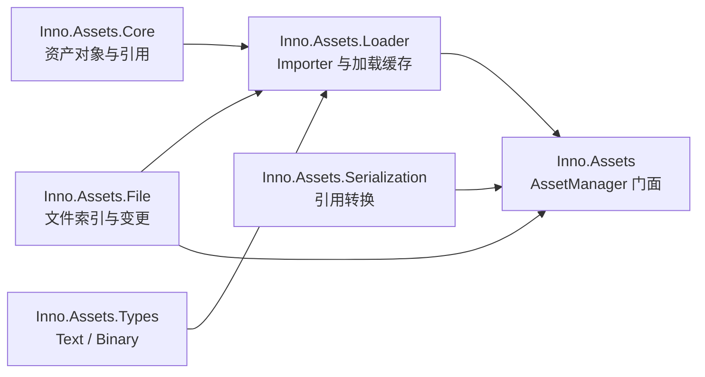

# Assets API

[返回 Wiki 首页](../README.md) · [前往 Core](../core/README.md)

Assets 层把磁盘源文件、`.meta` 身份、Importer、缓存产物与运行时 `AssetObject` 连接起来。大多数业务代码只调用 `AssetManager`；Importer 作者主要依赖 Loader 与 Core。



## 项目目录

| 项目 | 主要 namespace | 作用 |
| --- | --- | --- |
| [Inno.Assets](Inno.Assets.md) | `Inno.Assets` | 系统初始化、加载、保存、导入、查询和文件变更事件 |
| [Inno.Assets.Core](Inno.Assets.Core.md) | `Inno.Assets.Core` | `AssetObject`、依赖与引用诊断模型 |
| [Inno.Assets.File](Inno.Assets.File.md) | `Inno.Assets.File` | Project 文件树索引、路径/ID 映射与 watcher 事件 |
| [Inno.Assets.Loader](Inno.Assets.Loader.md) | `Inno.Assets.Loader` | Importer 扩展、导入上下文、Artifact 和加载缓存 |
| [Inno.Assets.Serialization](Inno.Assets.Serialization.md) | `Inno.Assets.Serialization` | AssetObject 引用序列化桥接与依赖收集 |
| [Inno.Assets.Types](Inno.Assets.Types.md) | `Inno.Assets.Types` | 内置 `TextAsset`、`BinaryAsset` |

## 最小工作流

```csharp
AssetManager.Initialize(new AssetManagerOptions
{
    assetRoot = Path.Combine(projectRoot, "Assets"),
    artifactRoot = Path.Combine(projectRoot, "Library", "Artifacts")
});

TextAsset text = AssetManager.Load<TextAsset>("Data/settings.json");
Console.WriteLine(text.content);

AssetManager.Shutdown();
```

在完整应用中优先让 `Shell.Initialize` 管理顺序。自定义 Importer 会由 `TypeCacheManager` 和 Loader Registry 自动发现；程序集候选代际在激活前会先建立完整 Registry，因此失败不会暴露半更新状态。
