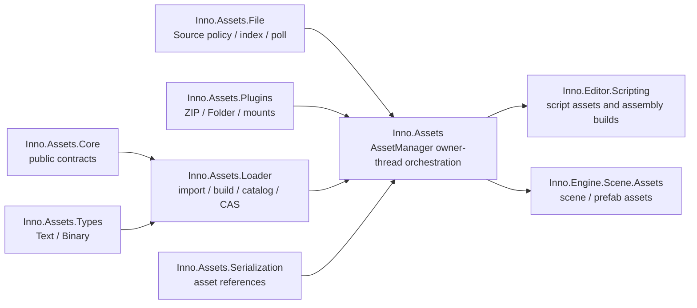

# Assets API

[返回 Wiki 首页](../README.md) · [前往 Core](../core/README.md) · [Editor Scripting](../editor/Inno.Editor.Scripting.md)

Assets 层把可写 `Assets/` 与已激活的只读 `Plugins/<id>` 组织成同一套多 Source Mount Database。受支持的文件共享 `.imeta`、Catalog、Importer、artifact、依赖图和 canonical cache；不存在 Plugin 专用 Loader 或序列化器。



## 项目边界

| 项目 | 稳定职责 |
| --- | --- |
| [Inno.Assets](Inno.Assets.md) | 应用组合根、owner-thread `Update`、查询、保存、变更发布与缓存策略 |
| [Inno.Assets.Core](Inno.Assets.Core.md) | `AssetObject`、artifact/catalog 快照、状态、依赖与 change-set 契约 |
| [Inno.Assets.File](Inno.Assets.File.md) | 物理 Source Tree、过滤、索引与只入队的 watcher |
| [Inno.Assets.Loader](Inno.Assets.Loader.md) | Importer/Build Processor Registry、`.imeta`、Catalog、CAS、canonical instance |
| [Inno.Assets.Serialization](Inno.Assets.Serialization.md) | `AssetObject` 引用编码、恢复与依赖收集 |
| [Inno.Assets.Types](Inno.Assets.Types.md) | 内置 `TextAsset` 与 `BinaryAsset` |
| [Inno.Assets.Plugins](Inno.Assets.Plugins.md) | 本地 ZIP/Folder、安全校验、只读 Source Mount、导出与原子激活 |

没有额外的 `Inno.Assets.Database` 或 `Inno.Assets.Pipeline` 程序集。Catalog、Artifact Store 和 transaction helper 都是 Loader 内部协作对象，避免为实现细节制造程序集依赖环。

## Project 磁盘布局

```text
<Project>/
├─ Assets/
│  ├─ Config/game.json
│  ├─ Config/game.json.imeta
│  ├─ Scripts/Player.cs
│  └─ Scripts/Player.cs.imeta
├─ Plugins/
│  └─ sample.gameplay.zip
├─ ProjectSettings.inno
└─ Library/
   ├─ Plugins/<id>/<contentHash>/
   ├─ AssetDatabase/
   │  ├─ Catalog.snapshot
   │  └─ Catalog.journal
   ├─ Artifacts/ab/cd/<sha256>/
   │  ├─ manifest
   │  └─ outputs/*.bin
   ├─ Assemblies/
   ├─ ScriptApi/
   └─ IDE/
```

`.imeta` 进入版本控制；`Library` 完全可重建，不应进入版本控制。Artifact 路径不包含 source path，因此移动源文件不会搬动 artifact。

## 最小工作流

```csharp
AssetManager.Initialize(AssetManagerOptions.Create(
    Path.Combine(projectRoot, "Assets"),
    Path.Combine(projectRoot, "Library")));

// Call once at the start of each host frame.
AssetManager.Update();

TextAsset settings = AssetManager.Load<TextAsset>(AssetPath.Project("Config/game.json"));
Console.WriteLine(settings.content);

AssetManager.Shutdown();
```

完整应用通常由 `Shell` 建立初始化顺序，并在每帧最前面调用 `AssetManager.Update()`。Importer 与 Build Processor 由基于 TypeCache 的 Registry 自动发现；Assembly reload 候选会先准备完整 Registry snapshot，冲突不会暴露半更新状态。

## 身份、路径与类型

- source persistent ID 来自 `.imeta`，不是路径 hash；文件或目录移动后 ID 不变。
- `AssetPath` 由 `AssetSourceId` 和 mount-local path 组成；相同文件名可在不同 mount 隔离共存。
- Project mount 可写；Plugin mount 只读，写操作返回明确错误。
- runtime Type 的 Stable Type ID 与 source persistent ID 是两套身份。脚本文件改名不会改变 Component/System 类型身份。
- 同一 persistent ID 在运行时最多对应一个 canonical `AssetObject`。
- 扩展名改变时 source ID 保留；若导入类型兼容则原位更新，不兼容时产生 replacement/missing 语义。
- Scene/Prefab 名称由文件名决定，但普通 prefab instance override 不会被源文件改名覆盖。

## 支持与 Unsupported

“支持”表示当前活动 `AssetImporterRegistry` 中有 Importer 接受该扩展名。新增脚本 Importer 并成功 reload 后，Registry version 改变，下一次 `AssetManager.Update()` 会重新对账并导入新支持的文件。没有 Importer 的文件：

- 出现在 FileBrowser 和 Source index；
- Catalog 状态为 `Unsupported`；
- 不生成 `.imeta` 或假 artifact；
- 不使用 Binary fallback。
