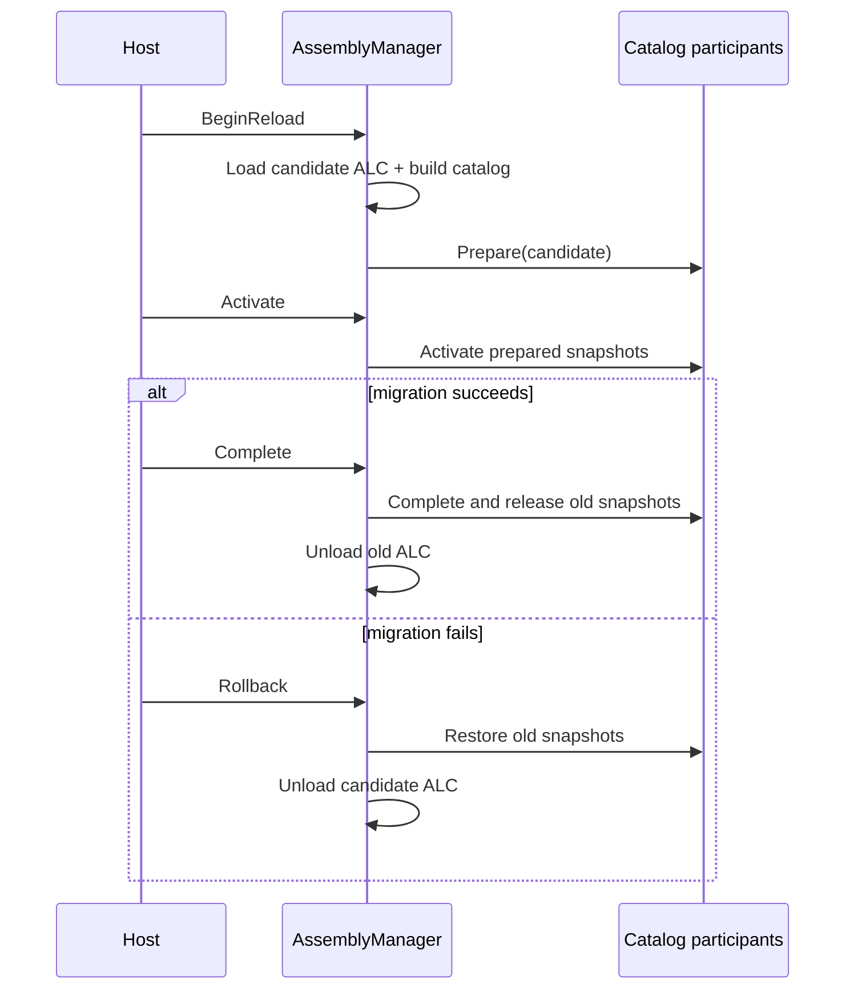

# Inno.Core.Assemblies

[Core 索引](README.md) · [下一页：Reflection](Inno.Core.Reflection.md) · [Wiki 首页](../README.md)

`Inno.Core.Assemblies` 是不依赖反射业务的程序集生命周期层。它管理当前“哪些程序集是活动的”、模块代际、shadow copy、collectible `AssemblyLoadContext` 和原子切换事务；它不知道 TypeCache、Importer、Converter、Component 或脚本目录。

## 源码目录

```text
Inno.Core.Assemblies/
├─ AssemblyManager.cs
├─ AssemblyManagerOptions.cs
├─ Catalog/              # 不可变程序集快照与 participant 事务契约
├─ Loading/              # 加载请求与 AssemblyLoadContext 实现
├─ Metadata/             # AssemblyGroup 与程序集 metadata 扩展
├─ Modules/              # 模块 handle、诊断信息与卸载监视
├─ Reloading/            # Reload session 与迁移上下文
└─ Internal/
   ├─ Catalog/           # participant 协调与原子刷新集合
   └─ Modules/           # Manager 内部模块状态
```

公开类型虽然按职责分文件夹，但继续使用稳定的 `Inno.Core.Assemblies` namespace；目录整理不会迫使调用方修改 using。只有具体的加载上下文实现位于内部的 `Inno.Core.Assemblies.Loading` namespace。

## 职责边界

- Host assembly：位于默认 ALC 的引擎程序集，由运行时拥有。
- External module：通过 `Register` 登记，生命周期仍由调用者拥有。
- Managed module：通过文件路径加载，由 Manager 创建独立 ALC，并可协作式卸载。
- Catalog participant：从完整程序集快照派生状态的通用事务参与者。
- 不负责：编译 C#、监视源文件、扫描扩展类型、迁移 Scene 实例。

## 初始化与关闭

```csharp
string cache = Path.Combine(projectRoot, "Library", "Assemblies");
AssemblyManager.Initialize(new AssemblyManagerOptions
{
    cacheDirectory = cache,
    preloadEntryAssemblyDependencies = true
});

// Register TypeCacheManager and other higher-level services here.

AssemblyManager.Shutdown();
```

`cacheDirectory` 用来存放 generation shadow copy，不能留空。`preloadEntryAssemblyDependencies=true` 会沿入口程序集引用图预加载相关 Inno host assembly，让尚未发生静态调用的模块也进入初始 catalog。

Shadow generation 是可再生缓存，不是序列化状态。collectible ALC 仍可达时目录会保留；`AssemblyUnloadMonitor` 观察到 ALC 不再可达后会协作式删除对应目录，后续 module staging 也会重试。Editor 异常退出或旧 ALC 一直存活时，下一次 `AssemblyManager.Initialize` 会清理上次进程遗留的 cache directory。非 collectible module 在当前进程中无法安全回收，只能在下一次进程初始化时清理其文件。

## AssemblyManager

| 成员 | 说明 |
| --- | --- |
| `bool isInitialized` | 是否已经建立全局程序集 catalog。 |
| `IReadOnlyList<AssemblyModuleInfo> modules` | 当前 managed/external 模块的非 owning 诊断视图。 |
| `Initialize(AssemblyManagerOptions)` | 初始化缓存目录、Host 发现和首次 catalog 发布。重复初始化会先关闭旧状态。 |
| `RegisterCatalogParticipant(IAssemblyCatalogParticipant)` | 注册派生状态参与者，并立即用当前 catalog 初始化；返回的 `IDisposable` 用于注销。 |
| `Load(AssemblyLoadRequest)` | shadow copy 并激活一个新 managed module，返回稳定 handle。 |
| `Register(string, IReadOnlyList<Assembly>)` | 注册调用者已经加载的 assembly；Manager 不拥有也不卸载它们。 |
| `BeginReload(handle, request)` | 加载并验证候选代际，但尚不发布；返回 reload session。 |
| `Unload(handle)` | 从活动 catalog 移除模块，并对 owned collectible ALC 发起卸载。 |
| `Refresh()` | 仅在 Host AssemblyLoad 令 catalog dirty 时刷新；无变化时不重建。 |
| `Rebuild()` | 强制重建当前 catalog，并事务刷新全部参与者；不会重新读取 DLL。 |
| `Shutdown()` | 发布空 catalog、注销事件并发起 owned module 卸载。 |

`AppDomain.AssemblyLoad` 事件只把 Host catalog 标记为 dirty。下一次 `Refresh()`（TypeCache 查询会间接调用）或显式 `Rebuild()` 才构建新快照。候选 ALC 在 `Activate()` 前不会出现在活动 catalog 中。

## 加载请求和模块信息

### AssemblyManagerOptions

| 属性 | 默认值 | 说明 |
| --- | --- | --- |
| `cacheDirectory` | `<AppBase>/AssemblyCache` | shadow generation 目录。Host 通常改成 `<Project>/Library/Assemblies`。 |
| `preloadEntryAssemblyDependencies` | `true` | 是否预加载入口程序集引用到的 Inno host dependencies。 |

### AssemblyLoadRequest

| 属性 | 说明 |
| --- | --- |
| `required moduleName` | 跨代际稳定的逻辑名称；Reload 时必须与旧模块一致。 |
| `required mainAssemblyPath` | 主 DLL 路径。 |
| `preloadAssemblyPaths` | 在同一 ALC 中预加载的 DLL 列表。 |
| `collectible` | 是否允许协作式 unload，默认 `true`。 |

### 诊断类型

- `AssemblyModuleHandle(Guid id)`：不持有 Assembly/ALC 的稳定句柄。
- `AssemblyModuleInfo`：record，公开 `handle`、`moduleName`、`generation`、`collectible`、`externallyOwned`、`status`、`assemblyNames`。
- `AssemblyModuleStatus.Active`：当前公开状态。
- `AssemblyUnloadMonitor.status` / `isCompleted`：通过弱引用观察旧 ALC 是否已经不可达。
- `AssemblyUnloadStatus.Pending` / `Completed`：卸载仍被引用或已经完成。

## 事务式 Reload

```csharp
using AssemblyReloadSession reload = AssemblyManager.BeginReload(handle, new AssemblyLoadRequest
{
    moduleName = "GameScripts",
    mainAssemblyPath = nextDll,
    preloadAssemblyPaths = pluginDlls,
    collectible = true
});

reload.Activate();
try
{
    // Migrate higher-level state while both old and candidate contexts are available.
    MigrateState(reload.context);
    AssemblyUnloadMonitor oldGeneration = reload.Complete();
}
catch
{
    reload.Rollback();
    throw;
}
```



`AssemblyReloadSession.Dispose()` 会对未完成 session 自动 rollback。`Complete()` 后 `AssemblyReloadContext` 会释放强引用，不能继续访问。

### AssemblyReloadContext

| 成员 | 说明 |
| --- | --- |
| `previousCatalog` / `candidateCatalog` | 激活前后的 `AssemblyCatalogSnapshot`。事务结束后不可访问。 |
| `module` | 正在重载的逻辑模块句柄。 |
| `GetContext<TContext>()` | 取得某个 participant 提供的迁移上下文；不存在或重复时抛异常。 |
| `TryGetContext<TContext>(out ...)` | 尝试取得唯一的指定上下文。 |

例如 Reflection participant 会提供 `TypeCacheReloadContext`：

```csharp
TypeCacheReloadContext types = reload.context.GetContext<TypeCacheReloadContext>();
types.TryResolveReplacement(oldInstance.GetType(), out Type? replacementType);
```

## 自定义 Catalog Participant

`IAssemblyCatalogParticipant` 只有一个 `Prepare(AssemblyCatalogSnapshot)`。实现必须旁路构建完整候选状态，返回 `IAssemblyCatalogTransaction`：

| 事务成员 | 契约 |
| --- | --- |
| `object? context` | 可选的短生命周期迁移上下文。 |
| `Activate()` | 原子发布候选状态。 |
| `Complete()` | 释放旧状态。 |
| `Rollback()` | 恢复旧状态并释放候选状态；应可安全重复调用。 |

参与者不要保留过期的 `AssemblyCatalogSnapshot`，因为其中的 `assemblies` 会强引用 collectible ALC。

## Assembly metadata

`AssemblyGroup` 值为 `None`、`Native`、`Game`、`Core`、`Plugin`、`Editor`。项目通过 `InnoAssemblyGroup` 生成 `Inno.AssemblyGroup` metadata，运行时可查询：

```csharp
AssemblyGroup group = typeof(MyType).Assembly.GetInnoAssemblyGroup();
```

`AssemblyExtensions.GetInnoAssemblyGroup(Assembly)` 使用弱缓存，不会固定可卸载程序集。

## 常见误区

- `Rebuild()` 只对当前活动 assembly 重做 catalog/participant 状态，不会从磁盘重新加载同名 DLL；文件内容变化必须走 `BeginReload()`。
- `Unload()` 是协作式的。旧线程、静态事件、缓存的 `Type`/delegate/instance 都可能让 monitor 长期 `Pending`。
- 不要从该层访问 TypeCache；依赖方向是 [Reflection](Inno.Core.Reflection.md) → Assemblies，而不是反过来。
- 一个时刻只允许一个 reload session；新 Load/Register/Unload/Rebuild 不能穿插在未完成事务中。
