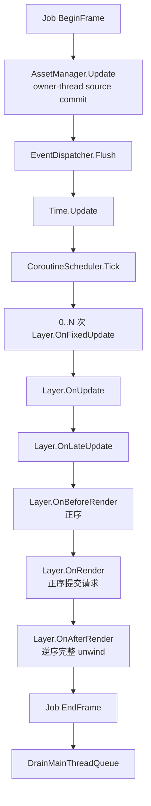

# Inno.Core.Framework

[上一页：Serialization](Inno.Core.Serialization.md) · [Core 索引](README.md) · [下一页：Events](Inno.Core.Events.md)

`Inno.Core.Framework` 提供应用级 `Shell`、Layer 栈和全局时间。Shell 是完整引擎宿主的组合根：按正确顺序初始化 Identity、Job、Logging、Assemblies、Reflection、Serialization 和 Assets，并由宿主每帧调用 `Tick`。

## ShellSettings

`new ShellSettings()` 会提供以下默认值：

| 属性 | 默认值 | 说明 |
| --- | --- | --- |
| `fixedDeltaTime` | `1/60f` | 固定模拟步长，必须大于 0。 |
| `maxFrameDeltaTime` | `0.25f` | 单帧 delta 上限，避免长暂停造成巨量补帧。 |
| `maxUpdateStepsPerTick` | `8` | 单次 Tick 最大 fixed step 数，必须大于 0。 |
| `useSingleThreadJobSystem` | `false` | 是否使用确定性的单线程 Job 后端。 |
| `jobWorkerCount` | `0` | Work-stealing worker 数，0 表示自动。 |
| `projectRootDirectory` | 当前目录 | Project 根目录；派生 `Assets`、`Library`、`Library/Assemblies` 与 `Logs`。 |

默认 Project layout：

```text
<Project>/
├─ Assets/              # 唯一 source database
├─ Library/             # catalog, CAS, script API, IDE and assembly cache
│  └─ Assemblies/       # AssemblyManager shadow generations
└─ Logs/
```

`Artifacts` 不再是独立 Project root；它固定派生为 `Library/Artifacts`。

## Shell API

| 成员 | 说明 |
| --- | --- |
| `static isInitialized` | singleton 是否存在。 |
| `static instance` | 获取 singleton；未初始化时抛异常。 |
| `eventDispatcher` | Shell 拥有的 dispatcher。 |
| `coroutineScheduler` | Shell 拥有的 scheduler。 |
| `layerStack` | Shell 拥有的 Layer stack。 |
| `Initialize(in ShellSettings)` | 初始化所有核心服务；重复调用会失败。 |
| `Shutdown()` | 逆序关闭服务；未初始化时安全返回。 |
| `Tick(totalTime, deltaTime)` | 推进一帧。负 delta 归零，过大 delta 被 clamp。 |

```csharp
Shell shell = Shell.Initialize(new ShellSettings
{
    projectRootDirectory = projectRoot,
    fixedDeltaTime = 1f / 60f,
    jobWorkerCount = 0
});

shell.layerStack.PushLayer(new GameLayer());
shell.Tick(totalTime, frameDelta);

Shell.Shutdown();
```

## 每帧顺序



达到 `maxUpdateStepsPerTick` 后仍存在陈旧 fixed debt 时会丢弃 accumulator，防止 spiral of death。

## Layer

派生 `Layer` 可覆盖：`OnAttach()`、`OnDetach()`、`OnFixedUpdate(float)`、`OnUpdate(float)`、`OnLateUpdate(float)`、`OnBeforeRender(float)`、`OnRender(float)`、`OnAfterRender(float)`。公开 `name` 用于显示/诊断。

渲染三阶段由 `LayerStack.RenderFrame` 作为一个异常安全作用域执行。前两阶段按栈顺序运行；只要某层成功完成 `OnBeforeRender`，它的 `OnAfterRender` 就一定会在逆序 unwind 中执行。多个提交或清理错误会合并为 `AggregateException`，从而不会因首个错误跳过后续资源清理。

受保护事件 API：

- `Listen<TEvent>(handler, priority)`：订阅当前 Layer 的 hub；Detach 时自动 dispose。
- `ListenOnce<TEvent>(handler, priority)`：一次性监听。
- `Announce(Event)`：只在当前 Layer hub 中立即分发。

```csharp
public sealed class GameLayer : Layer
{
    public GameLayer() : base("Game") { }

    public override void OnAttach()
    {
        Listen<WindowCloseEvent>(e => e.HandleInGlobal());
    }

    public override void OnUpdate(float deltaTime)
    {
        // Game update.
    }
}
```

## LayerStack

| 成员 | 说明 |
| --- | --- |
| `count` / `[index]` | 读取当前 Layer/Overlay 数量和元素。 |
| `LayerStack(Func<EventHub>)` | 每附加一层用 factory 创建独立 hub。 |
| `PushLayer(Layer)` | 插入 overlay 之前的 base layer 区域。 |
| `PushOverlay(Layer)` | 添加到栈顶 overlay 区域。 |
| `PopLayer` / `PopOverlay` | 只从对应分区移除；成功返回 `true`。 |
| `OnFixedUpdate` / `OnUpdate` / `OnLateUpdate` | 按栈顺序调用所有层。 |
| `RenderFrame` | 正序执行 Before/Render，再逆序执行 After；失败时仍完整 unwind。 |
| `Clear()` | 逆序 Detach 并移除全部层。 |
| `Dispose()` | Clear 后永久关闭 stack。 |

同一 Layer 实例不能重复附加。Push 中 `OnAttach` 抛异常时会回滚插入并释放 hub。

## Time

`Time` 是只读全局帧状态：

- `time`：宿主传入的累计运行秒数。
- `deltaTime`：clamp 后的当前帧秒数。
- `fixedTime`：已经执行的固定模拟累计秒数。
- `fixedDeltaTime`：最近固定步长。

它由 Shell 更新，业务代码不应自行写入。
