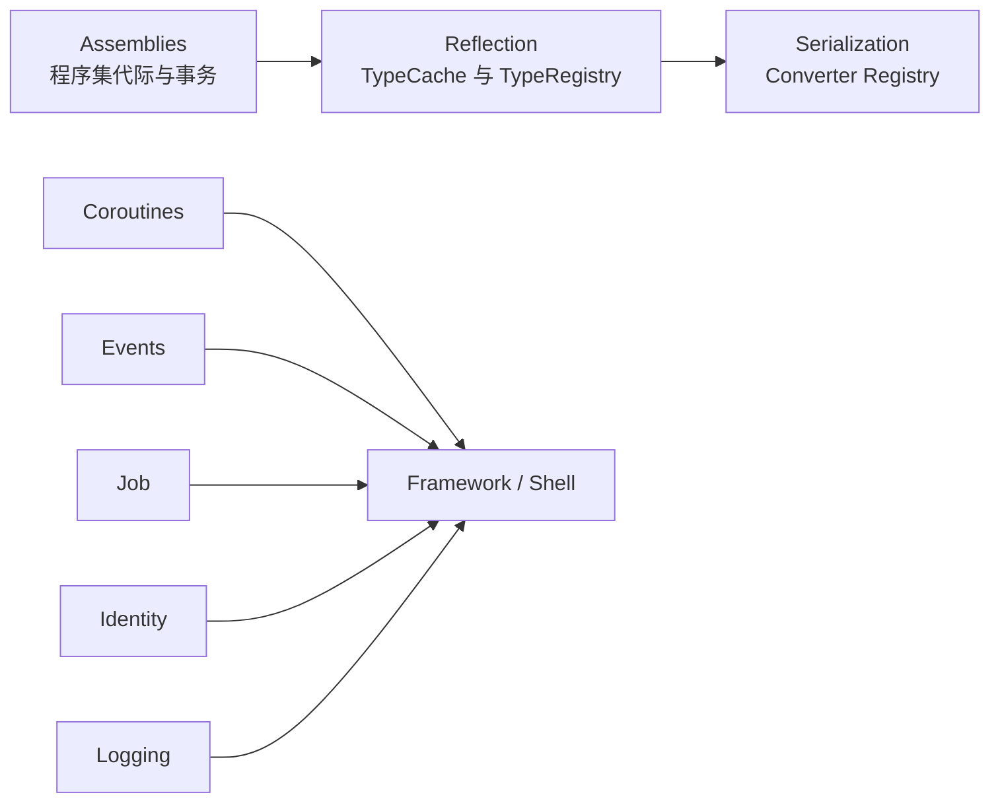

# Core API

[返回 Wiki 首页](../README.md) · [前往 Assets](../assets/README.md)

Core 层提供不依赖具体游戏内容的基础设施。程序集关系中最重要的一条是：`Inno.Core.Assemblies` 只管理程序集目录；`Inno.Core.Reflection` 单向引用它，并从程序集快照派生类型快照和扩展 Registry。



## 项目目录

| 项目 | 主要 namespace | 作用 |
| --- | --- | --- |
| [Inno.Core.Assemblies](Inno.Core.Assemblies.md) | `Inno.Core.Assemblies` | 活动程序集目录、shadow copy、collectible ALC、事务式 Reload |
| [Inno.Core.Reflection](Inno.Core.Reflection.md) | `Inno.Core.Reflection` | 类型发现、Stable/Runtime Type ID、通用 `TypeRegistry<TSnapshot>` |
| [Inno.Core.Serialization](Inno.Core.Serialization.md) | `Inno.Core.Serialization` | 二进制对象图序列化、属性元数据和 Converter |
| [Inno.Core.Framework](Inno.Core.Framework.md) | `Inno.Core.Framework` | `Shell`、Layer 栈、帧循环与 `Time` |
| [Inno.Core.Events](Inno.Core.Events.md) | `Inno.Core.Events` | 有序 EventHub、立即/排队分发、输入和窗口事件 |
| [Inno.Core.Coroutines](Inno.Core.Coroutines.md) | `Inno.Core.Coroutines` | IEnumerator 协程和等待指令 |
| [Inno.Core.Job](Inno.Core.Job.md) | `Inno.Core.Job` | 单线程/工作窃取任务系统和依赖句柄 |
| [Inno.Core.Identity](Inno.Core.Identity.md) | `Inno.Core.Identity` | 运行时对象 ID、持久 ID 与注册表 |
| [Inno.Core.Input](Inno.Core.Input.md) | `Inno.Core.Input` | 键盘、鼠标和光标枚举 |
| [Inno.Core.Logging](Inno.Core.Logging.md) | `Inno.Core.Logging` | 日志门面、日志项、Console/File Sink |
| [Inno.Core.Mathematics](Inno.Core.Mathematics.md) | `Inno.Core.Mathematics` | 向量、矩阵、四元数、颜色和矩形 |
| [Inno.Core.Storage](Inno.Core.Storage.md) | `Inno.Core.Storage` | 依赖图与可索引对象池 |

## 标准初始化顺序

直接使用 `Shell.Initialize(...)` 时，Shell 会协调主要 Manager。若在工具或测试中手动初始化，基础顺序为：

```csharp
AssemblyManager.Initialize(new AssemblyManagerOptions
{
    cacheDirectory = Path.Combine(projectRoot, "Library", "Assemblies")
});
TypeCacheManager.Initialize();
SerializationManager.Initialize();

// ... application work ...

SerializationManager.Shutdown();
TypeCacheManager.Shutdown();
AssemblyManager.Shutdown();
```

关键原因是 Reflection 的 TypeCache 是 Assembly catalog 的参与者，而 Serialization 的 Converter Registry 又从 TypeCache 构建。
