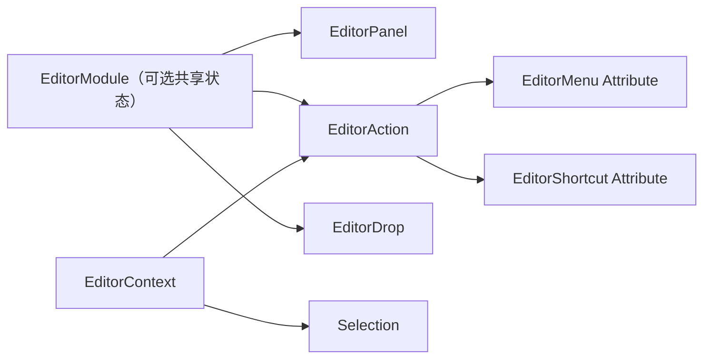

# Inno.Editor.Core

[Editor 索引](README.md) · [Interactions](Inno.Editor.Interactions.md) · [Wiki 首页](../README.md)

`Inno.Editor.Core` 只保存扩展作者真正需要的中立契约：Module、Panel、Action、Menu、Drop、Selection 与 Rename state。它不知道 ImGui、TypeCache、Scene、Asset、Logging，也不存在 Service Locator。

## 最小模型



扩展类型由 Attribute 自动发现。类型只允许一个构造函数；构造参数只能是 `EditorContext` 或一个已发现的 `EditorModule`。因此不用 `Add()`、`Register()`、`GetService()` 或静态 singleton。

## Module

只有多个扩展需要共享状态或生命周期时才创建 Module：

```csharp
[EditorModule(order: 100)]
public sealed class AnimationModule : EditorModule
{
    public AnimationDocument? activeDocument { get; private set; }

    protected override void OnUpdate(EditorContext context)
    {
        // Update feature state before panels are drawn.
    }
}
```

Panel 或 Action 直接构造注入：

```csharp
public sealed class AnimationPanel(AnimationModule animation) : EditorPanel
{
    public override void Draw(EditorContext context)
    {
        // Use animation directly.
    }
}
```

## Action 与快捷键

Action 是所有可执行编辑器行为的唯一模型。`EditorAction<TTarget>` 自动完成 target 类型检查；`Query` 决定菜单/快捷键此时是否显示、是否启用和是否勾选。

```csharp
public sealed class AnimationSurface;

[EditorAction("animation.create-state", typeof(AnimationSurface))]
[EditorShortcut(KeyCode.N, primary: true, surface: typeof(AnimationSurface))]
public sealed class CreateStateAction(AnimationModule animation)
    : EditorAction<AnimationDocument>
{
    protected override EditorActionState Query(
        EditorActionContext<AnimationDocument> context)
        => context.target.isReadOnly
            ? EditorActionState.disabled
            : EditorActionState.enabled;

    protected override void Execute(
        EditorActionContext<AnimationDocument> context)
    {
        context.target.CreateState();
    }
}
```

内建通用 ID 位于 `EditorActionIds`：Save、Open、Rename、Delete、Reset、Remove、TogglePanel。领域 ID 放在领域项目，例如 `SceneActionIds` 和 `AssetActionIds`。

## 任意层级菜单

菜单直接标在 Action 上，路径中的 `/` 没有层数限制：

```csharp
[EditorAction("animation.create-blend-tree", typeof(AnimationSurface))]
[EditorMenu(
    typeof(AnimationSurface),
    "Create/State Machine/Blend Tree",
    order: 300,
    separatorBefore: true)]
public sealed class CreateBlendTreeAction : EditorAction<AnimationDocument>
{
    protected override void Execute(
        EditorActionContext<AnimationDocument> context)
    {
    }
}
```

需要根据 TypeCache 或运行时数据生成条目时使用 `EditorMenuSource`：

```csharp
[EditorMenuSource(typeof(AnimationSurface))]
public sealed class AnimationNodeMenuSource : EditorMenuSource
{
    public override void Build(EditorMenuContext context, EditorMenuBuilder builder)
    {
        builder.Add("Create/Node/Clip", "animation.create-node", argument: typeof(ClipNode));
    }
}
```

所有主菜单、右键菜单和搜索菜单进入相同的 `EditorMenuModel`，由同一个 ImGui renderer 绘制，因此 hover、separator、disabled、checked 和快捷键标签一致。

## Typed Drag and Drop

```csharp
[EditorDrop(typeof(AnimationSurface), priority: 100)]
public sealed class ClipDrop : EditorDrop<ClipAsset, AnimationDropTarget>
{
    protected override EditorDropStatus Query(
        EditorDropContext<ClipAsset, AnimationDropTarget> context)
        => context.target.canAccept
            ? EditorDropStatus.Accept()
            : EditorDropStatus.rejected;

    protected override EditorDropResult Drop(
        EditorDropContext<ClipAsset, AnimationDropTarget> context)
    {
        context.target.Add(context.source);
        return EditorDropResult.Accepted(context.source);
    }
}
```

Native ImGui payload 只保存一个 `Guid` session token；真实对象由 runtime 管理。程序集 generation 改变、source 无效或 drop 完成时 session 自动取消。

## Panel 与 Modal

```csharp
[EditorPanel("animation.graph", "Animator", order: 600)]
public sealed class AnimationPanel(AnimationModule animation) : EditorPanel
{
    public override void Draw(EditorContext context)
    {
    }
}
```

Panel 不注册自身，也不保存 title/id；这些稳定信息全部在 Attribute。Reload 总是保留 `isOpen`；实现 `IEditorPanelReloadState` 后还可以迁移纯字节状态。非 dockable UI 使用 `[EditorModal]`，runtime 统一处理居中、淡入淡出和交互阻塞。

## Scripting facade

EditorScripts 使用 `InnoEditor.Core`、`InnoEditor.Commands`、`InnoEditor.Menus`、`InnoEditor.DragDrop`、`InnoEditor.Panels`。完全禁止 global using；每个脚本必须显式声明普通 `using`。Registry、TypeCache snapshot、runtime router 和 mutable catalog 不进入 facade。
