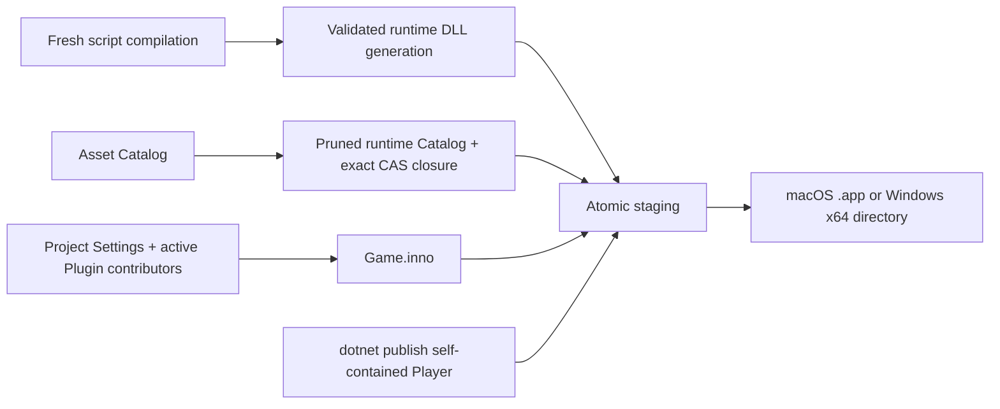

# Inno.Editor.Exporting

[Editor 索引](README.md) · [Plugin](../plugins/Inno.Plugins.Authoring.md) · [Assets](../assets/Inno.Assets.md) · [Runtime](../runtime/Inno.Runtime.md) · [Player](../runtime/Inno.Player.md)

`Inno.Editor.Exporting` 完整拥有 Editor 的导出 feature：File 菜单 Action、两个 modal 和 Build Pipeline 协调。它不把导出职责塞进 File Browser，也不向业务 Panel 暴露内部 staging 状态。

## 用户入口

File 菜单提供：

- `Export as Plugin...`：把当前完整 Project 直接打包成确定性的 `.iplugin`；其容器格式是 ZIP，但 `.zip` 不是可安装扩展名。
- `Export as Game...`：先请求一个新的 runtime script generation，再组合只含 Artifact 的平台 Player。

Game Application ID 与 Plugin ID 都直接读取 `Project/Identity/Project ID`，不允许在 Build Settings 或 modal 中维护第二份身份。其余 modal 字段在 `Build/Game` 或 `Build/Plugin` 中拥有持久默认值；打开 modal 时从 `Settings.Build.inno` 创建临时 draft，修改只影响本次导出。

两个 modal 都保持 draft、状态与错误在同一 feature module 中；Game 构建进行时可以取消，且不会留下半成品。相对输出路径统一以项目根解析。

## Game 构建流水线



导出使用编译结果中的精确 runtime-scope DLL 路径，不复制 Editor assembly。`AssetPipeline.ExportRuntimeArtifacts` 只选择 `AssetDeploymentScope.Runtime` 的资产，验证其完整 `asset-state`/`runtime` output 与 runtime dependency 闭包，并只复制裁剪 Catalog 实际引用的 CAS bundle。`.cs`、`.iasmdef` 等 `AuthoringOnly` 输入已经体现在 DLL 中，不进入部署 Catalog。Project source、`.imeta`、Editor Layout、History、Library 中无关 cache 和编译中间态都不会进入游戏。

输出布局：

```text
Sample.app/Contents/
├─ MacOS/Sample
├─ Info.plist
└─ Resources/Content/

Sample-Windows-x64/
├─ Sample.exe
└─ Content/

Content/
├─ Game.inno
├─ Settings.Project.inno
├─ Managed/*.dll
├─ Sources/<source-id>/          空身份根，不含创作文件
├─ AssetDatabase/Catalog.snapshot
└─ Artifacts/<content-addressed bundles>
```

`Settings.Build.inno` 与 `Settings.Editor.inno` 都不属于 runtime content；Game 只部署经过组合的 `Settings.Project.inno`。Plugin 导出同样不会把宿主项目的 Build/Editor 设置打进 `.iplugin`。

macOS 初始目标是 `osx-arm64`，Windows 初始目标是 `win-x64`。内置 publisher 使用当前 .NET SDK 的 Release、自包含、单文件发布，并把目标平台的 SDL3、BGFX、shader/texture tools 与 BGFX include 收集到 Player 的 `native/`。SDK Host 会被解析为绝对路径：显式 `DOTNET_HOST_PATH` / 架构对应的 `DOTNET_ROOT` 优先，随后检查当前运行时安装根、进程 `PATH`、用户级 `~/.dotnet` 和标准系统安装目录。因此从 macOS GUI 启动 Editor 时不依赖终端注入 `PATH`。当前宿主目标缺少 release native bundle 时会自动调用仓库的 SDL3/BGFX builder；跨宿主导出则要求 `.lib/<product>/<target>` 已由对应目标机器准备好。平台合成发生在 staging 目录，最终目录通过 rename 原子安装，并在替换失败时恢复旧输出。

## 公开 API

| API | 作用 |
| --- | --- |
| `GameBuildTarget` | 当前支持 `MacOSArm64` 与 `WindowsX64`。 |
| `GameExportRequest` | 产品身份、启动 Scene、目标、输出目录、Player project 与窗口尺寸；`Validate()` 使用跨 macOS/Windows 的可移植名称规则。 |
| `GameExportResult` | 最终路径、目标、资产数、Artifact bundle 数和 runtime assembly 数。 |
| `GameExportService` | 验证当前 generation、导出内容、调用 publisher 并原子安装平台输出。 |
| `IGamePlayerPublisher` | 平台可执行发布边界；便于 CI、未来 AOT/toolchain 和测试替换。 |
| `GamePlayerPublishRequest` | 传递 Player project、空 staging 目录与目标。 |
| `DotnetGamePlayerPublisher` | 当前 self-contained .NET publisher。 |

```csharp
var exporter = new GameExportService();
GameExportResult result = await exporter.ExportAsync(
    new GameExportRequest
    {
        applicationId = "sample.game",
        productName = "Sample Game",
        startupScene = "Scenes/Startup.iscene",
        target = GameBuildTarget.MacOSArm64,
        outputDirectory = buildRoot,
        playerProjectPath = GameExportService.FindPlayerProjectPath()
            ?? throw new InvalidOperationException("Player source is unavailable.")
    },
    compilation.runtimeAssemblyPaths,
    cancellationToken);
```

`IGamePlayerPublisher` 是刻意保留的唯一平台扩展面：后续新增签名、AOT、商店容器或远程构建时替换 publisher，不改变 Artifact、manifest 或 Editor UI。实现必须把完整可执行结果写入指定空 staging 目录，并在返回前保证文件可读取。

## 生命周期、失败与热重载

- Game 导出必须从 `IEditorScriptCompilation.RequestCompilation()` 开始；失败或尚未激活的 generation 不能打包。
- 启动 Scene 必须已导入为 `SceneAsset` 且不位于 `~` authoring sample；runtime assembly 必须存在且文件名唯一。
- Plugin/Game 输出都拒绝写入当前 `Assets`、`Plugins`、`Library` 或 active mount，防止 watcher 把 staging/package 当作新的项目输入。
- 取消会终止 `dotnet publish` 进程树，并清理 staging；已安装的旧 build 不受影响。
- 导出期间捕获的是 active Asset/Plugin/Settings generation。Plugin 候选仍在准备时不会混入半个新 generation。
- Player project 不可定位、SDK 缺少目标 runtime pack、跨平台 native bundle 尚未准备、目标不可写或产物结构不完整都会作为明确失败返回。
- 该项目没有 `InternalsVisibleTo`；测试通过公开 publisher 边界验证两种平台布局。

[下一页：Editor Global](Inno.Editor.Panel.Global.md)
