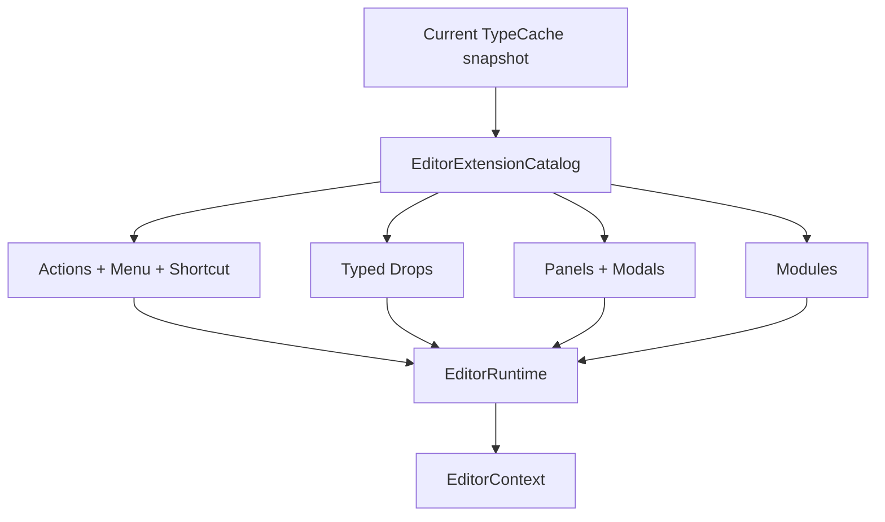

# Inno.Editor.Interactions

[Editor 索引](README.md) · [Core contracts](Inno.Editor.Core.md) · [Application](Inno.Editor.Application.md)

`Inno.Editor.Interactions` 是唯一的通用 Editor runtime。外部只需要 `EditorRuntime`；其余 Catalog、Activator、Router 和 ModalHost 都是 internal。

## 运行流程



Application 的完整使用只有：

```csharp
EditorRuntime runtime = new(projectDirectory);
runtime.Start();
runtime.Update(deltaTime, totalTime, isFocused);
runtime.Draw();
runtime.HandleKeyPressed(keyEvent);
runtime.Dispose();
```

Feature 不调用这些组合 API，只消费 `EditorContext`。

## 单一 Catalog 与构造注入

一次 TypeCache snapshot 会旁路构建一个完整 `EditorExtensionCatalog`。它同时验证：

- Module 构造依赖和依赖环。
- Action ID、surface、target 与 priority 冲突。
- Menu source 和任意深度路径。
- Drop source/target/surface 冲突。
- Panel/Modal 稳定 ID。
- 所有扩展类型只能有一个构造函数。

任一候选失败时，旧 snapshot 原样可用，Assembly reload 回滚。Host ALC 中 `Type` 未变化的扩展实例会跨脚本 generation 保留，不会因为脚本热重载而重启 ScriptManager、Scene workspace 或内建 Panel；插件 generation 的旧实例会 Stop/Detach/Dispose 后释放。

## Action Router

解析顺序为：

1. 精确 surface。
2. target 类型距离。
3. Attribute priority。
4. 完整类型名稳定排序。

菜单点击只把 Action 放进队列；UI traversal 结束后执行。快捷键 Attribute 也解析为同一个 Action ID，不存在独立 HotKey service 或 Panel delegate 注册。

## Menu Catalog

`EditorMenuCatalog` 合并三种来源：

- Action 上的 `[EditorMenu]`。
- `[EditorMenuSource]` 的动态 placement。
- 根据 `[EditorPanel]` 自动生成的 View 菜单。

构造完成后输出不可变 `EditorMenuModel`。ImGui 只负责递归渲染，不知道 Scene、Asset 或具体业务。

## Drop Router

`EditorDropRouter` 维护单个 managed drag session，按 source type、target type、surface 和 priority 找到最具体的 `EditorDrop<TSource,TTarget>`。Renderer 不再维护 `INNO_ASSET`、`INNO_SCENE` 等业务 payload 常量。

## Modal Host

`EditorModalHost` 对所有 `[EditorModal]` 使用统一过渡：固定主 viewport 正中心、固定 theme width、最短可见时间、淡入淡出和 blocking。脚本编译弹窗只是 `Inno.Editor.Scripting` 中的普通 Modal，不再写在 `EditorLayer`。

## 边界

Interactions 不引用 Assets、Scene、Diagnostics 或 Scripting；它只引用 Core contract、Reflection registry 和 ImGui renderer。它不导出 Scripting facade，EditorScripts 面向 [Core contracts](Inno.Editor.Core.md)。
