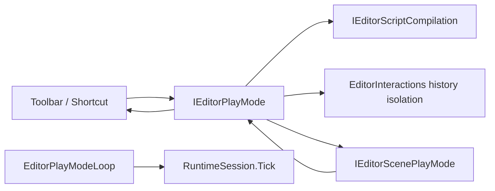

# Inno.Editor.PlayMode

[Editor 索引](README.md) · [Interactions](Inno.Editor.Interactions.md) · [Scene](Inno.Editor.Scene.md) · [Scripting](Inno.Editor.Scripting.md) · [Application](Inno.Editor.Application.md)

`Inno.Editor.PlayMode` 负责在可编辑 Scene 文档与可运行游戏副本之间执行原子切换。它只编排脚本就绪、Scene 隔离、History 隔离和游戏生命周期；不拥有 Scene 文件格式、脚本编译器、渲染 Pipeline 或具体 Panel。

## 职责与边界



- `EditorPlayModeModule` 是 order `220` 的 internal 协调器；Scene workspace 与 Scene edits 分别为 `200`、`210`，因此 Play 切换只会观察已准备好的文档服务。
- Entry 主动申请 fresh compilation ticket，并只接受该 ticket 成功发布的脚本 generation；失败、取消或被更新请求取代时保持 Edit Scene，不创建半成品 Runtime Session。
- Scene session 用当前序列化契约把所有已加载 Edit Scene 复制到独立 `RuntimeSession`，保留 Scene、GameObject、Component 与 System 的 persistent ID、顺序和 active Scene。Edit 对象始终留在 Edit Session，不参与游戏生命周期。
- 全部 runtime Scene 准备成功后，Game View、Scene View、Hierarchy、Inspector、Selection 与 Gizmo 在同一安全点切换到 Play Session。它们读取并操作同一批 runtime 对象，不会出现画面已经运行而 Inspector 仍指向 Edit 对象的分裂状态。
- Play runtime Scene 允许通过 Hierarchy、Inspector、Gizmo 和 Scene Action 临时编辑，但 `IEditorSceneWorkspace.canPersist` 为 `false`、`IsDirty` 恒为 `false`，Scene/Prefab Open/Save 被拒绝，因此不会显示未保存 `*`，也不会把 runtime 状态写入项目 Asset。
- Undo/Redo 使用临时分支；Play 中产生的记录在退出时释放，进入 Play 前的 Undo 与 Redo 分支完整恢复。
- runtime fixed/update/late callback 发生异常时立即停止后续模拟并请求恢复 Edit；异常只保存为字符串，不长期持有可卸载脚本 generation 的 `Exception` 或 delegate。
- Play Mode 是正式的 assembly reload participant。任何 Runtime、Editor Scripts 或 Plugin generation 将要切换时，Play Session 会在 candidate 激活前同步释放 Scene lease、Runtime Session 与临时 History，然后回到 `Editing`；旧 simulation 绝不会跨代码 generation 继续运行。
- Console 默认启用 `Clear on Play`：新请求进入 `Compiling` 时清除上一轮普通日志，但保留仍然有效的 Compiler、Importer、Rendering 等 current diagnostics。当前 Play 的全部等级日志在退出后仍可检查，并在下一次 Play 开始时清除。用户只通过 `Editor/Diagnostics/Console` Settings 修改该策略，Console toolbar 不持有重复状态。

## 公共 API

### EditorPlayModeState

| 值 | 含义 |
| --- | --- |
| `Editing` | 可编辑 Scene 文档已加载，模拟停止。 |
| `Compiling` | 等待本次请求对应的 fresh compilation ticket 成功。 |
| `Preparing` | 创建 Runtime Session 并物化隔离 Scene 候选。 |
| `Playing` | runtime Scene 副本接收完整游戏生命周期。 |
| `Stopping` | 停止模拟并按顺序释放 Scene lease、Runtime Session 与 History isolation。 |
| `Failed` | 最近一次编译、准备或模拟失败；诊断保留到再次 Enter 或显式 Exit。 |

### IEditorPlayMode

| 成员 | 语义 |
| --- | --- |
| `state` | 当前六态状态机。 |
| `isPlaying` | 仅在 `Playing` 时为 `true`。 |
| `lastFailure` | 最近一次编译门禁、切换或模拟失败；新 entry 请求会清空。 |
| `activeSessionId` | 当前 Play 日志 Session；不在 Play 请求内时为 `none`。 |
| `stateChanged` | 状态实际变化后触发；单个订阅者异常被隔离。 |
| `EnterPlayMode()` | 从 `Editing` 或 `Failed` 接受 fresh 请求；返回值表示是否接受。 |
| `ExitPlayMode()` | 取消 Compiling、停止 Preparing/Playing，或把 `Failed` 清回 `Editing`；其他状态返回 `false`。 |

最小调用不需要触碰 Scene 或 Scripting：

```csharp
if (playMode.state is EditorPlayModeState.Editing or EditorPlayModeState.Failed)
    _ = playMode.EnterPlayMode();
else if (playMode.state is EditorPlayModeState.Compiling
         or EditorPlayModeState.Preparing
         or EditorPlayModeState.Playing)
    _ = playMode.ExitPlayMode();
```

EditorScripts 使用逻辑 namespace：

```csharp
using InnoEditor.PlayMode;
```

脚本清单只导出 `EditorPlayModeState` 与 `IEditorPlayMode`。实现 Module、Scene session、Toolbar Action 和 host loop 不作为脚本契约。

### EditorPlayModeController

`EditorPlayModeController` 是 Editor host 组合使用的确定性状态机实现。构造函数接收 `EngineHost`、Play `RuntimeSessionOptions`、`IEditorScenePlayMode`、`IEditorScriptCompilation`、`IEditorHistoryIsolation` 与 `LogRouter`；调用方通过 `AdvanceTransition()` 在 frame-safe point 推进状态，通过 `Tick(deltaTime)` 推进当前 Play Session，并最终 `Dispose()`。它同时实现 `IEditorReloadParticipant`：该接口由 `EditorPlayModeModule` 注册到统一 reload coordinator，不加入 `InnoEditor.PlayMode` 脚本 facade。

### EditorPlayModeLoop

`EditorPlayModeLoop` 是 Application 组合根使用的稳定 host service。每个 Editor frame 调用一次 `Tick(deltaTime)`；只有 `Playing` 状态才转发给当前隔离 `RuntimeSession.Tick`，由 Session 统一推进 fixed、variable、late lifecycle、Jobs、Coroutines 与 Event queue。普通 feature 不得自行推进该 loop，避免同一 Play Session 收到重复生命周期。

## UI 与快捷键

Play 是 `editor/main-menu` area 的 targetless Action，通过通用 `[EditorToolbarItem]` 放在 MenuBar 几何中心。Edit 状态显示 Play icon；Compiling、Preparing 和 Playing 显示 Stop icon 与 checked accent；Stopping 时保持 Stop icon 但禁用，直到资源释放完成。Failed 状态允许重新 Enter 或清除失败。Tooltip 来自 Action 的动态 `EditorActionState.displayName`。

Command/Ctrl + `P` 与 icon 使用同一个 Action 和状态查询，因此不会形成第二套切换逻辑。

## 完整切换顺序

进入 Play：

1. `EnterPlayMode()` 申请新的 `IScriptCompilationTicket` 并切换到 `Compiling`。
2. 只等待该 ticket；stale、canceled、superseded 或 failed ticket 都不能激活 Play。
3. ticket 成功后切换到 `Preparing`，保留 Edit Undo/Redo 并启动隔离 History 分支。
4. 创建新的 Play `RuntimeSession`，捕获 Edit Scene 起始快照，并在候选 Play SceneWorld 中完整反序列化同 persistent ID 的对象图。
5. 全部 Scene、顺序与 active Scene 成功后提交 Scene lease；workspace 按 persistent ID 把 Scene selection 重映射到 runtime copy，并让全部 Scene-facing Editor feature 一次切换到 Play Scene。
6. 切换为 `Playing`，下一帧开始由 Play Session 推进完整游戏生命周期。

退出 Play：

1. Action 立即切换到 `Stopping`，因此下一次 host callback 不再模拟。
2. 释放 Scene lease，全部 Scene-facing Editor feature 原子切回始终存在的 Edit Scene；若当前 runtime selection 在 Edit 世界有同 ID 对象则重映射，否则恢复进入 Play 前的 selection。
3. Dispose Play `RuntimeSession`，统一卸载 runtime-only Scene、对象、Coroutines、Jobs、Events、Asset 和日志资源。
4. 释放临时 History，恢复进入 Play 前的完整 Undo/Redo 分支。
5. 切回 `Editing`。若释放失败则保留 `Stopping` 和诊断，并在后续安全点重试，不会错误宣称已回到 Edit。

## Reload、保存与生命周期注意事项

- Play Session 不通过“修改 Edit 后恢复 bytes”实现隔离；即使 runtime Transform、Component 或层级发生任意变化，Edit 对象引用和值都不变。
- Editor Application 的 Update、Draw 与键盘操作都进入当前 Play `RuntimeSession` execution scope。这样 Inspector Drawer、Hierarchy Action、Gizmo 和脚本静态门面解析的是同一个 Session；进入 Play 的首个绘制帧也不会短暂回落到 Edit context。
- Asset Source change 在 Play 中排队；退出后 Edit workspace 才消费重命名等 source 同步，避免 authoring 元数据与 runtime 副本混用。
- `editor.ini` capture 在 Play 中仍写入进入 Play 前的已保存 Scene setup，不会把 runtime-only Scene 变成下次启动工作区。
- Assembly reload 请求会结束当前 Play，而不是迁移一个正在执行的游戏世界。该退出发生在 TypeCache/Plugin candidate 激活之前，因此旧 Component、System、Coroutine、Job 与脚本对象不会固定退休 ALC；即使后续 candidate activation 回滚，也保持 Edit，不尝试重建已经丢弃的瞬态 simulation。
- 正常 Editor shutdown 会先恢复 Edit state，再执行 Scene workspace teardown；History scope 与 Scene session 都是幂等释放。
- Play Mode 不持久化自己的状态。Editor 重启始终从 Edit 开始，不自动恢复运行中的游戏。

## 测试覆盖

`Inno.Editor.PlayMode.Tests` 覆盖 compilation ticket 等待/失败/取消、History 分支恢复、fixed/update/late dispatch、模拟异常恢复、Play 日志保留策略、Edit/Play graph identity，以及 viewport presentation 的 Edit → Play → Edit 原子切换。`Inno.Editor.Scripting.Tests.PluginReloadQuiescesPlaySessionBeforeRetiringItsAssemblyGeneration` 使用真实 collectible Plugin Component 验证重载前退出 Play、恢复 Edit/History，并确认退休 Plugin 与脚本 ALC 可回收。测试还验证 runtime Transform 变化由 presentation 立即观察、Edit Transform 不变、非法候选 Play world 不会替换 Edit presentation。`Inno.Editor.Interactions.Tests` 另覆盖 Toolbar 模型发现与 History isolation 的 Undo/Redo 双分支保留。

## 相邻页面

- 上一页：[Inno.Editor.Interactions](Inno.Editor.Interactions.md)
- Scene 隔离实现：[Inno.Editor.Scene](Inno.Editor.Scene.md)
- 编译门禁：[Inno.Editor.Scripting](Inno.Editor.Scripting.md)
- 下一页：[Inno.Editor.Application](Inno.Editor.Application.md)
