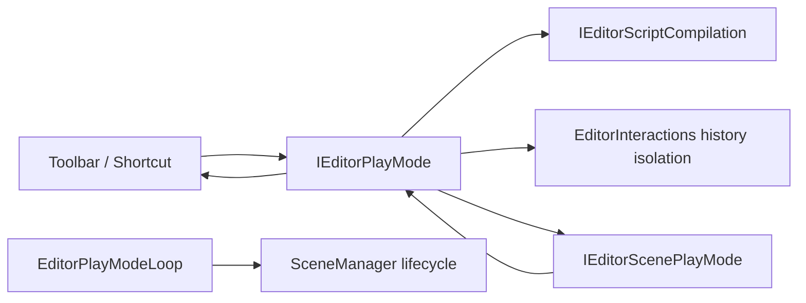

# Inno.Editor.PlayMode

[Editor 索引](README.md) · [Interactions](Inno.Editor.Interactions.md) · [Scene](Inno.Editor.Scene.md) · [Scripting](Inno.Editor.Scripting.md) · [Application](Inno.Editor.Application.md)

`Inno.Editor.PlayMode` 负责在可编辑 Scene 文档与可运行游戏副本之间执行原子切换。它只编排脚本就绪、Scene 隔离、History 隔离和游戏生命周期；不拥有 Scene 文件格式、脚本编译器、渲染 Pipeline 或具体 Panel。

## 职责与边界



- `EditorPlayModeModule` 是 order `220` 的 internal 协调器；Scene workspace 与 Scene edits 分别为 `200`、`210`，因此 Play 切换只会观察已准备好的文档服务。
- Entry 先等待当前脚本 generation 完成编译和原子激活；编译失败时保持 Edit Scene，不创建半成品 runtime graph。
- Scene session 用当前序列化契约复制所有已加载 Scene，保留 Scene、GameObject、Component、System 的 persistent ID、顺序、active Scene 与 Selection；Edit 对象会被卸载，运行副本不会与 Edit 引用混用。
- Play 期间 Scene/Prefab Save 禁用，Scene dirty/source 查询固定读取进入 Play 前的 Edit baseline。Asset 自身的独立编辑不属于 Scene 回滚范围。
- Undo/Redo 使用临时分支；Play 中产生的记录在退出时释放，进入 Play 前的 Undo 与 Redo 分支完整恢复。
- runtime fixed/update/late callback 发生异常时立即停止后续模拟并请求恢复 Edit；异常只保存为字符串，不长期持有可卸载脚本 generation 的 `Exception` 或 delegate。
- Console 以状态事件建立 Play 日志 marker；成功退出时删除本次运行的 Runtime `Debug`/`Info`，保留 warning/error/fatal、Editor 日志和当前诊断。

## 公共 API

### EditorPlayModeState

| 值 | 含义 |
| --- | --- |
| `Editing` | 可编辑 Scene 文档已加载，模拟停止。 |
| `EnteringPlay` | 等待脚本就绪并准备隔离事务；再次请求 Exit 可取消。 |
| `Playing` | runtime Scene 副本接收完整游戏生命周期。 |
| `ExitingPlay` | 停止模拟，丢弃 runtime graph，恢复 Edit Scene 与 History。 |

### IEditorPlayMode

| 成员 | 语义 |
| --- | --- |
| `state` | 当前四态状态机。 |
| `isPlaying` | 仅在 `Playing` 时为 `true`。 |
| `lastFailure` | 最近一次编译门禁、切换或模拟失败；新 entry 请求会清空。 |
| `stateChanged` | 状态实际变化后触发；单个订阅者异常被隔离。 |
| `EnterPlayMode()` | 仅从 `Editing` 接受新请求；返回值表示是否接受。 |
| `ExitPlayMode()` | 取消尚未开始的 entry，或从 `Playing` 请求恢复；重复请求返回 `false`。 |

最小调用不需要触碰 Scene 或 Scripting：

```csharp
if (playMode.state == EditorPlayModeState.Editing)
    _ = playMode.EnterPlayMode();
else if (playMode.state is EditorPlayModeState.EnteringPlay or EditorPlayModeState.Playing)
    _ = playMode.ExitPlayMode();
```

EditorScripts 使用逻辑 namespace：

```csharp
using InnoEditor.PlayMode;
```

脚本清单只导出 `EditorPlayModeState` 与 `IEditorPlayMode`。实现 Module、Scene session、Toolbar Action 和 host loop 不作为脚本契约。

### EditorPlayModeLoop

`EditorPlayModeLoop` 是 Application 组合根使用的稳定 host service。公开的 `FixedUpdate(float)`、`Update(float)`、`LateUpdate(float)` 只在 `Playing` 转发到 `SceneManager`；其余状态为空操作。普通 feature 不应自行推进该 loop，也不应同时挂载 `GameLayer`，否则同一 Scene 会收到重复生命周期。

## UI 与快捷键

Play 是 `editor/main-menu` area 的 targetless Action，通过通用 `[EditorToolbarItem]` 放在 MenuBar 几何中心。Edit 状态显示 Play icon；Entering/Playing 显示 Stop icon 和 checked accent；Exiting 时保持 Stop icon 但禁用，直到恢复完成。Tooltip 来自 Action 的动态 `EditorActionState.displayName`。

Command/Ctrl + `P` 与 icon 使用同一个 Action 和状态查询，因此不会形成第二套切换逻辑。

## 完整切换顺序

进入 Play：

1. `EnterPlayMode()` 切换到 `EnteringPlay`。
2. 等待 `IEditorScriptCompilation.state == Ready`；`Compiling`/`Initializing` 保持等待，`Failed` 返回 Edit。
3. 保留 Edit Undo/Redo 并启动空的临时 History 分支。
4. 捕获全部 Edit Scene baseline，卸载 Edit graph，反序列化同 ID runtime graph。
5. 恢复 active Scene 与 Selection 到 runtime 对象，切换为 `Playing`。
6. Host 的 fixed、variable、late callback 开始驱动 runtime Scene。

退出 Play：

1. Action 立即切换到 `ExitingPlay`，因此下一次 host callback 不再模拟。
2. 清除 runtime Selection，卸载所有 runtime Scene，包括 Play 中新建或额外打开的 Scene。
3. 从进入 Play 时的 bytes 重建 Edit graph，恢复 Scene 顺序、active Scene、Selection、source path 与 dirty baseline。
4. 释放临时 History，恢复完整 Edit Undo/Redo 分支。
5. 切回 `Editing`。若恢复失败，保持 `ExitingPlay` 并在后续安全点重试，不会错误宣称已回到 Edit。

## Reload、保存与生命周期注意事项

- Play 中发生脚本 reload 时，Scene reload participant 只把新实例重新绑定到现有 runtime 文档，不重写进入 Play 时捕获的 Edit baseline。退出后仍恢复最初的 Edit graph。
- Asset Source change 在 Play 中排队；退出后 Edit workspace 才消费重命名等 source 同步，避免 runtime 副本污染文档元数据。
- `editor.ini` capture 在 Play 中仍写入进入 Play 前的已保存 Scene setup，不会把 runtime-only Scene 变成下次启动工作区。
- 正常 Editor shutdown 会先恢复 Edit state，再执行 Scene workspace teardown；History scope 与 Scene session 都是幂等释放。
- Play Mode 不持久化自己的状态。Editor 重启始终从 Edit 开始，不自动恢复运行中的游戏。

## 测试覆盖

`Inno.Editor.PlayMode.Tests` 覆盖编译等待、编译失败、entry 取消、History 分支恢复、fixed/update/late dispatch、模拟异常恢复、Play 日志保留策略，以及 Scene graph/identity/selection/Edit 值回滚。`Inno.Editor.Interactions.Tests` 另覆盖 Toolbar 模型发现与 History isolation 的 Undo/Redo 双分支保留。

## 相邻页面

- 上一页：[Inno.Editor.Interactions](Inno.Editor.Interactions.md)
- Scene 隔离实现：[Inno.Editor.Scene](Inno.Editor.Scene.md)
- 编译门禁：[Inno.Editor.Scripting](Inno.Editor.Scripting.md)
- 下一页：[Inno.Editor.Application](Inno.Editor.Application.md)
