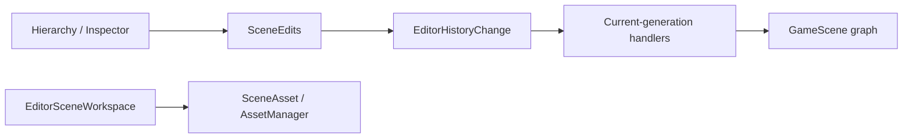

# Inno.Editor.Scene

[Editor 索引](README.md) · [Interactions](Inno.Editor.Interactions.md) · [Engine Scene](../engine/Inno.Engine.Scene.md)

`Inno.Editor.Scene` 是 Scene 领域的 Editor feature，不是 Panel。它拥有 Scene document workspace、统一的 `SceneEdits` 修改门面，以及把 Scene 修改解释为中立 Undo/Redo payload 的 Handler。Hierarchy 和 Inspector 只负责收集用户意图与绘制，不再各自实现 Scene 快照或恢复算法。

## 边界与依赖



- `EditorSceneWorkspace` 管理已打开 Scene、asset source path、dirty baseline、Save/Save As 与 `editor.ini` workspace 状态。
- `SceneEdits` 是 Scene 内容修改的唯一高层入口，负责“修改成功后记录最小可逆数据”。
- History Handler 根据 persistent ID 和 Stable Type ID 在当前 generation 重新解析对象，不保留旧实例。
- `Inno.Engine.Scene.Assets` 提供通用 property/subtree/element 序列化能力，但不知道 Editor History。

## 公共 API

### EditorSceneWorkspace

| 成员 | 作用 |
| --- | --- |
| `scenes` / `activeScene` | 查询当前 Editor scene setup。 |
| `CreateScene()` / `OpenScene(path)` / `CloseScene(scene)` | additive document 生命周期；关闭不删除 Asset。 |
| `SaveScene(scene, directory)` | 保存到已有 source；未保存 Scene 在 fallback directory 创建 Asset。 |
| `SaveSceneToDirectory(scene, directory)` | 显式保存到目标 Asset directory。 |
| `SavePrefab(gameObject, directory)` | 从 GameObject 子树保存 PrefabAsset。 |
| `IsDirty(scene)` | 比较当前序列化 hash、source path 与文件名。 |
| `TryGetSourcePath(scene, out path)` | 查询保存后的 source-relative path。 |
| `Refresh()` | 在 owner thread 消费 Asset rename/missing 变化。 |

Workspace 实现 `IEditorWorkspaceState`。它只把已保存 Scene 的顺序与 active Scene 写入 `[InnoEditor][Module.scene-workspace]`。Selection 属于当前 Editor session，不写入项目设置。未保存 Scene 内容和 dirty 内存同样不会写入 `editor.ini`；它们必须保存为 `.iscene`。

### SceneEdits

| 分类 | 成员 |
| --- | --- |
| Scene 文档 | `CreateScene`、`CloseScene`、`SetSceneIndex` |
| GameObject | `CreateGameObject`、`DeleteGameObject`、`RenameGameObject`、`SetGameObjectActive`、`ChangeHierarchy` |
| Component | `AddComponent`、`RemoveComponent`、`ResetComponent`、`SetComponentIndex` |
| System | `AddSystem`、`RemoveSystem`、`ResetSystem`、`SetSystemIndex` |
| 属性 | `ChangeProperty` |

Action 只需要注入该 Module：

```csharp
[EditorAction("animation.add-controller", "scene/hierarchy")]
public sealed class AddAnimationControllerAction(SceneEdits edits)
    : EditorAction<GameObject>
{
    protected override void Execute(EditorActionContext<GameObject> context)
        => edits.AddComponent(
            context.target,
            typeof(AnimationController),
            "Add Animation Controller");
}
```

扩展不需要知道 History protocol、序列化格式或 Handler。若未来 Animation Graph 有自己的数据模型，应由 Animation Editor Module 采用相同模式提供 `AnimationEdits`，而不是把 Animation 特例塞进 `SceneEdits`。

## 最小历史数据

| 修改 | payload |
| --- | --- |
| serializable property | target persistent ID、root property key、before/after property bytes |
| name / active | target persistent ID、scalar kind、before/after value |
| Component/System | owner、element persistent ID、Stable Type ID、before/after index、property bytes、incoming references |
| GameObject create/delete | Scene/root/parent ID、sibling index、仅该 subtree bytes、incoming references |
| hierarchy | 受影响对象的 before/after parent ID 与 sibling index |
| Scene order | Scene persistent ID 与两个 index |
| Scene create/close | 一个 document 的 Scene bytes、source identity、dirty baseline、active/selection IDs |

因此修改一个 `int` 不会序列化整张 Scene。只有删除一棵 GameObject 子树或关闭一个 Scene document 时，payload 才与实际被移除的数据规模相关；超过 History inline threshold 后自动存到磁盘。

## 原子性与热重载

- Property restore 在应用前捕获该 property 的 rollback bytes；失败时恢复原值。
- Component/System 恢复失败会删除候选元素；对既有元素 Reset/排序失败会恢复原 state 与 index。
- Subtree restore 在创建或 placement 失败时销毁候选 subtree。
- Hierarchy Handler 先捕获当前 placements；发生 cycle 或设置失败时反向恢复。
- 类型由 Stable Type ID 在当前 TypeCache generation 解析。缺失类型、目标缺失或 schema 不兼容会形成 History barrier，原栈保持不变。
- 脚本 reload 后中立 payload 保留，Handler Registry 切换到新 generation；History 不固定旧 ALC。

## 相关序列化 API

`ScenePropertySerialization`、`SceneSubtreeSerialization` 和 `SceneElementSerialization` 位于 [Inno.Engine.Scene.Assets](../engine/Inno.Engine.Scene.Assets.md)。它们是可复用的 Scene 数据工具，不引用 Editor。属性字节底层使用 [Inno.Core.Serialization](../core/Inno.Core.Serialization.md) 的中立 property-data 格式。

## Scripting API

EditorScripts 显式 `using InnoEditor.Scene;` 后可以使用 `EditorSceneWorkspace` 与 `SceneEdits`。内部 History payload 类型、引用扫描器和 Handler 不导出；一般扩展只调用领域门面，不自行复制 Scene 协议。
