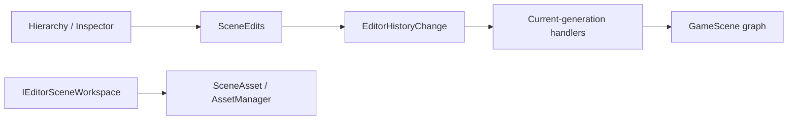

# Inno.Editor.Scene

[Editor 索引](README.md) · [Interactions](Inno.Editor.Interactions.md) · [Engine Scene](../engine/Inno.Engine.Scene.md)

`Inno.Editor.Scene` 是 Scene 领域的 Editor feature，不是 Panel。它拥有 Scene document workspace、统一的 `SceneEdits` 修改门面，以及把 Scene 修改解释为中立 Undo/Redo payload 的 Handler。Hierarchy 和 Inspector 只负责收集用户意图与绘制，不再各自实现 Scene 快照或恢复算法。

## 边界与依赖



- `IEditorSceneWorkspace` 是只读查询与 Open/Save 工作流契约；internal `EditorSceneWorkspace` Module 管理文档、source path、dirty baseline 与 `editor.ini` 状态。
- `SceneEdits` 是 Scene 内容修改的唯一高层入口，负责“修改成功后记录最小可逆数据”。
- History Handler 根据 persistent ID 和 Stable Type ID 在当前 generation 重新解析对象，不保留旧实例。
- `Inno.Engine.Scene.Assets` 提供通用 property/subtree/element 序列化能力，但不知道 Editor History。

## 公共 API

### IEditorSceneWorkspace

| 成员 | 作用 |
| --- | --- |
| `scenes` / `activeScene` | 查询当前 Editor scene setup。 |
| `Open(path)` | additive 打开 Scene asset。 |
| `Save(scene, directory)` | 保存到已有 source；未保存 Scene 在调用方提供的 fallback directory 创建 Asset。 |
| `SaveToDirectory(scene, directory)` | 显式保存到目标 Asset directory。 |
| `SavePrefab(gameObject, directory)` | 从 GameObject 子树保存 PrefabAsset。 |
| `IsDirty(scene)` | 比较当前序列化 hash、source path 与文件名。 |
| `TryGetSourcePath(scene, out path)` | 查询保存后的 source-relative path。 |

具体 `EditorSceneWorkspace`、构造函数、Create/Close/Clear/Refresh 和 history/document helpers 均为 internal；可逆的 Scene 文档修改必须经 `SceneEdits`。该 Module 通过标准 protected Capture/Restore hooks 只把已保存 Scene 的顺序与 active Scene 写入 `[InnoEditor][Module.scene-workspace]`。Selection 属于当前 Editor session，不写入项目设置。未保存 Scene 内容和 dirty 内存同样不会写入 `editor.ini`；它们必须保存为 `.iscene`。

Scene setup 因缺少 Stable Type ID 或反序列化失败而暂时无法恢复时，Workspace 保留 pending setup 并发布 `Scene Workspace Restore` Diagnostic。TypeCache generation 或 Asset Database 变化后会重新尝试，成功才清除。每帧可重试的 document synchronization 使用 Scene persistent ID 维护独立 Diagnostic；相同异常只在首次出现时写入 Log，恢复、关闭 Scene 或停止 Workspace 都会清理对应状态。Missing Scene 被明确跳过属于历史事件，因此只写 Log warning。

Asset Browser 重命名已加载 Scene 的 source 时，Workspace 会同步 document path 与 Scene 显示名，并以同步前的实际序列化内容重新判断 dirty 状态。单纯的 source 重命名会重建保存基线，不产生未保存标记；已有 Scene 内容修改仍保持 dirty。

### SceneEdits

| 分类 | 成员 |
| --- | --- |
| Scene 文档 | `CreateScene`、`CloseScene`、`SetSceneIndex` |
| GameObject | `CreateGameObject`、`DeleteGameObject`、`RenameGameObject`、`SetGameObjectActive`、`SetGameObjectTag`、`SetGameObjectLayer`、`ChangeHierarchy` |
| Component | `AddComponent`、`RemoveComponent`、`ResetComponent`、`SetComponentIndex` |
| System | `AddSystem`、`RemoveSystem`、`ResetSystem`、`SetSystemIndex` |
| 属性 | `ChangeProperty` |

Action 只需要注入该 Module：

```csharp
[EditorAction("animation.add-controller", "scene/hierarchy")]
public sealed class AddAnimationControllerAction(SceneEdits edits)
    : EditorAction<GameObject>
{
    protected override void Execute(EditorActionContext<GameObject> context)
        => edits.AddComponent(
            context.target,
            typeof(AnimationController),
            "Add Animation Controller");
}
```

扩展不需要知道 History protocol、序列化格式或 Handler。若未来 Animation Graph 有自己的数据模型，应由 Animation Editor Module 采用相同模式提供 `AnimationEdits`，而不是把 Animation 特例塞进 `SceneEdits`。

## 最小历史数据

| 修改 | payload |
| --- | --- |
| serializable property | target persistent ID、root property key、before/after property bytes |
| name / active / tag | target persistent ID、scalar kind、before/after value |
| Component/System | owner、element persistent ID、Stable Type ID、before/after index、property bytes、incoming references |
| GameObject create/delete | Scene/root/parent ID、sibling index、仅该 subtree bytes、incoming references |
| hierarchy | 受影响对象的 before/after parent ID 与 sibling index |
| Scene order | Scene persistent ID 与两个 index |
| Scene create/close | 一个 document 的 Scene bytes、source identity、dirty baseline、active/selection IDs |

因此修改一个 `int` 不会序列化整张 Scene。只有删除一棵 GameObject 子树或关闭一个 Scene document 时，payload 才与实际被移除的数据规模相关；超过 History inline threshold 后自动存到磁盘。

## 原子性与热重载

- Property/Scalar restore 在应用前捕获实际 rollback bytes/value，并检查严格恢复结果。
- Component/System 与 Subtree 同时捕获 element/subtree、index、parent、state 和受影响 incoming references；恢复任一步失败都会逆序删除候选并还原原引用。
- Hierarchy 与 Scene order 先捕获真实 placement/index；正向和反向 placement 都检查结构化结果。
- Scene document 把 loaded document、source path、active scene、dirty baseline 作为一个领域事务；Selection/焦点只在成功后 best-effort 通知，不决定 History 成败。
- `SceneEdits` 对 after capture、payload/blob 创建或 `RecordApplied` 失败执行严格 before rollback；补偿也失败时抛出包含两侧原因的聚合异常，禁止留下未记录修改。
- 类型由 Stable Type ID 在当前 TypeCache generation 解析。缺失类型、目标缺失或 schema 不兼容会形成 History barrier，原栈保持不变。
- 脚本 reload 后中立 payload 保留，Handler Registry 切换到新 generation；History 不固定旧 ALC。

## 相关序列化 API

`ScenePropertySerialization`、`SceneSubtreeSerialization` 和 `SceneElementSerialization` 位于 [Inno.Engine.Scene.Assets](../engine/Inno.Engine.Scene.Assets.md)。它们是可复用的 Scene 数据工具，不引用 Editor。属性字节底层使用 [Inno.Core.Serialization](../core/Inno.Core.Serialization.md) 的中立 property-data 格式。

## Scripting API

EditorScripts 显式 `using InnoEditor.Scene;` 后只看到 `IEditorSceneWorkspace` 与 `SceneEdits`。concrete Workspace、构造/关闭/清空/刷新 helper、History payload、引用扫描器和 Handler 不导出；工作流通过接口，所有可逆 Scene 数据修改通过 `SceneEdits`。
