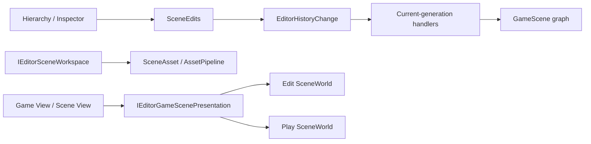

# Inno.Editor.Scene

[Editor 索引](README.md) · [Interactions](Inno.Editor.Interactions.md) · [Scene](../scene/Inno.Scene.md)

`Inno.Editor.Scene` 是 Scene 领域的 Editor feature，不是 Panel。它拥有 Scene document workspace、统一的 `SceneEdits` 修改门面，以及把 Scene 修改解释为中立 Undo/Redo payload 的 Handler。Hierarchy 和 Inspector 只负责收集用户意图与绘制，不再各自实现 Scene 快照或恢复算法。

## 边界与依赖



- `IEditorSceneWorkspace` 是当前 Edit/Play presentation 与 Open/Save 工作流契约；internal `EditorSceneWorkspace` Module 管理 Edit 文档、source path、dirty baseline、selection 映射与 `editor.ini` 状态。
- `IEditorGameScenePresentation` 是 Game View 与 Scene View 的只读游戏场景来源；它在 Play 世界完整物化成功后才从 Edit SceneWorld 原子切换到 Play SceneWorld。
- `SceneEdits` 是 Scene 内容修改的唯一高层入口，负责“修改成功后记录最小可逆数据”。
- History Handler 根据 persistent ID 和 Stable Type ID 在当前 generation 重新解析对象，不保留旧实例。
- `Inno.Scene.Assets` 提供通用 property/subtree/element 序列化能力，但不知道 Editor History。
- Scene feature 通过 [Inno.Editor.Core](Inno.Editor.Core.md) 中 `EditorReloadCoordinator` 的中立 participant contract 接入 assembly reload，并自行拥有 Scene migration、Coroutine 清理和 Missing/reload diagnostics；`Inno.Editor.Scripting` 不引用 Scene 项目或 Scene 类型。
- `EditorReloadCoordinator.Register` 返回的 registration lease 强持有 participant，而 Coordinator 只保留弱引用。只要 Workspace 持有 lease，GC 就不能移除 Scene migration；Workspace Dispose 会注销并释放 participant，避免新 TypeCache 激活后仍遗留旧 collectible `Type` 的 Component/System。该所有权契约适用于所有 Editor reload feature，不是 Scene 私有补丁。

## 公共 API

### IEditorSceneWorkspace

| 成员 | 作用 |
| --- | --- |
| `scenes` / `activeScene` | Edit 时查询 authoring Scene；Play 时查询同 persistent ID 的 runtime copy。 |
| `canPersist` | 当前 Scene 是否是可保存的 Edit 文档；Play runtime copy 为 `false`。 |
| `Open(path)` | additive 打开 Scene asset。 |
| `Save(scene, directory)` | 保存到已有 source；未保存 Scene 在调用方提供的 fallback directory 创建 Asset。 |
| `SaveToDirectory(scene, directory)` | 显式保存到目标 Asset directory。 |
| `SavePrefab(gameObject, directory)` | 从 GameObject 子树保存 PrefabAsset。 |
| `IsDirty(scene)` | Edit 时比较序列化 hash、source path 与文件名；Play copy 恒为 `false`。 |
| `TryGetSourcePath(scene, out path)` | 查询保存后的 source-relative path。 |

具体 `EditorSceneWorkspace`、构造函数、Create/Close/Clear/Refresh 和 history/document helpers 均为 internal；可逆的 Scene 文档修改必须经 `SceneEdits`。该 Module 通过标准 protected Capture/Restore hooks 只把已保存 Scene 的顺序与 active Scene 写入 `[InnoEditor][Module.scene-workspace]`。Selection 属于当前 Editor session，不写入项目设置。未保存 Scene 内容和 dirty 内存同样不会写入 `editor.ini`；它们必须保存为 `.iscene`。

Scene setup 因缺少 Stable Type ID 或反序列化失败而暂时无法恢复时，Workspace 保留 pending setup 并发布 `Scene Workspace Restore` Diagnostic。TypeCache generation 或 Asset Database 变化后会重新尝试，成功才清除。每帧可重试的 document synchronization 使用 Scene persistent ID 维护独立 Diagnostic；相同异常只在首次出现时写入 Log，恢复、关闭 Scene 或停止 Workspace 都会清理对应状态。Missing Scene 被明确跳过属于历史事件，因此只写 Log warning。

Asset Browser 移动或重命名已加载 Scene 的 source（包括移动其父目录）时，Workspace 会同步 document path、persistent source identity 与 Scene 显示名。source relocation 是文件元数据变化，不是 Scene 内容编辑：`IsDirty` 会先消费已提交的 source move，因此同一 UI frame 的 Hierarchy 绘制也不会短暂出现 `*`；原本 clean 的文档在同步显示名后重建保存基线，原本 dirty 的文档则保持 dirty，移动操作不会掩盖已有内容修改。

dirty baseline 也不会把任意 Asset 引用的 `lastKnownPath` 当成 Scene 内容。Scene/Prefab 的真实落盘仍保留该路径提示，但 Workspace 的语义 hash 只比较 persistent asset identity、Stable Type ID 与 Scene property state。因此 File Browser 对 SceneAsset 或其他被引用 Asset 的 Rename/Move 不会使引用它的 loaded Scene 显示 `*`；引用被用户替换为另一个 persistent asset 才属于真实内容变化。

脚本 Component/System 在 reload 中进入或退出 Missing 同样不是用户数据编辑。Scene serializer 保持原逻辑类型与 property payload 的规范表示；Workspace reload participant 还会在迁移前强制判定每个文档原本是否 dirty，并在整次迁移成功后只为原本 clean 的文档重建保存基线。因此即使恢复后的脚本增加了带默认值的序列化属性，Hierarchy 也不会把 generation migration 显示成用户造成的 `*`。原本 dirty 的文档绝不会被 rebase 掩盖，Missing 期间对其他 Scene 数据的真实修改仍正常保持 dirty、可以保存，并且不会破坏未来的原位恢复。恢复是否完整由原子 reload 事务和精确 diagnostics 判断，而不复用 dirty 标记：构造、属性或引用恢复不兼容会报告对应问题；事务失败则恢复旧 generation 与旧 dirty baseline。

Scene Missing 是当前状态诊断，而不是 Scripting 编译诊断。Workspace 启动、loaded Scene 集合变化或 TypeCache generation 变化后的下一次主线程更新，会完整替换 `Missing Scene Scripts` 诊断组；因此刚打开的 Scene 若含 Missing 会立即出现在 Console，类型恢复或 Scene 关闭后也会被清除。协调 reload 的成功、失败恢复与无变化 diagnostics refresh 由 Scene 自己响应，不要求 Scripting 理解 Scene。

### IEditorGameScenePresentation

这是 viewport presentation 与 Scene owner 之间唯一的 Edit/Play 场景协议：

| 成员 | 作用 |
| --- | --- |
| `Capture()` | 返回一个集合经过防御性复制的 `EditorScenePresentationSnapshot`，其中 scenes 与 active Scene 来自同一次捕获。 |
| `EditorScenePresentationSnapshot.scenes` | 当前帧应作为游戏内容呈现的有序 Scene；Game View 与 Scene View 不得修改集合或跨帧保留引用。 |
| `EditorScenePresentationSnapshot.activeScene` | 同一 snapshot 内的 active Scene；无 active Scene 时为 `null`。 |

该接口不暴露 `RuntimeSession`、可切换 setter、Rendering 类型或生命周期操作。Viewport 通过不可变 snapshot 读取当前 world；Hierarchy、Inspector 和 Scene Action 通过 `IEditorSceneWorkspace`/`SceneEdits` 操作同一个当前 world。Play 时这些修改只进入 runtime copy 与临时 History 分支；Edit 文档所有权没有转移，Save/Open 被 persistence gate 拒绝，`IsDirty` 也不会把 runtime 修改显示成 `*`。

### IEditorScenePlayMode

该公开接口是 [Play Mode](Inno.Editor.PlayMode.md) 的跨程序集基础设施，不是普通 Scene 编辑入口：

| 成员 | 作用 |
| --- | --- |
| `BeginPlayMode(runtimeSession)` | 捕获完整 Edit scene setup，把同 persistent ID 的独立对象图物化到 Play `RuntimeSession`，提交 presentation/selection 切换并返回幂等 lease。 |
| 返回 lease 的 `Dispose()` | 停止向 Game View 与 Scene View 呈现 Play Scene；Edit Scene 从未被替换，因此无需反序列化恢复。 |

物化是候选事务：目标 world 非空、快照捕获失败或任一 Scene 反序列化失败时，会清空候选 Play world，所有 Editor feature 继续指向 Edit world。只有全部 Scene、顺序和 active Scene 都准备完成后才发布 Play lease，并按 persistent ID 把 Selection 映射到 runtime copy。Play session 活动期间 Workspace 不消费 Asset source change、不把 runtime graph 写入 `editor.ini`，并禁止 Scene/Prefab Open/Save；退出后释放 runtime-only 对象、恢复 Edit Selection，排队的 source change 才应用到始终保留的 Edit 文档。

### SceneEdits

| 分类 | 成员 |
| --- | --- |
| Scene 文档 | `CreateScene`、`CloseScene`、`SetSceneIndex` |
| GameObject | `CreateGameObject`、`DeleteGameObject`、`RenameGameObject`、`SetGameObjectActive`、`SetGameObjectTag`、`SetGameObjectLayer`、`ChangeHierarchy` |
| Component | `AddComponent`、`RemoveComponent`、`ResetComponent`、`SetComponentIndex` |
| System | `AddSystem`、`RemoveSystem`、`ResetSystem`、`SetSystemIndex` |
| 属性 | `ChangeProperty` |

Action 只需要注入该 Module：

```csharp
[EditorAction("animation.add-controller", "scene/hierarchy")]
public sealed class AddAnimationControllerAction(SceneEdits edits)
    : EditorAction<GameObject>
{
    protected override void Execute(EditorActionContext<GameObject> context)
        => edits.AddComponent(
            context.target,
            typeof(AnimationController),
            "Add Animation Controller");
}
```

扩展不需要知道 History protocol、序列化格式或 Handler。若未来 Animation Graph 有自己的数据模型，应由 Animation Editor Module 采用相同模式提供 `AnimationEdits`，而不是把 Animation 特例塞进 `SceneEdits`。

## 最小历史数据

| 修改 | payload |
| --- | --- |
| serializable property | target persistent ID、root property key、before/after property bytes |
| name / active / tag | target persistent ID、scalar kind、before/after value |
| Component/System | owner、element persistent ID、Stable Type ID、before/after index、property bytes、incoming references |
| GameObject create/delete | Scene/root/parent ID、sibling index、仅该 subtree bytes、incoming references |
| hierarchy | 受影响对象的 before/after parent ID 与 sibling index |
| Scene order | Scene persistent ID 与两个 index |
| Scene create/close | 一个 document 的 Scene bytes、source identity、dirty baseline、active/selection IDs |

因此修改一个 `int` 不会序列化整张 Scene。只有删除一棵 GameObject 子树或关闭一个 Scene document 时，payload 才与实际被移除的数据规模相关；超过 History inline threshold 后自动存到磁盘。

## 原子性与热重载

- Property/Scalar restore 在应用前捕获实际 rollback bytes/value，并检查严格恢复结果。
- Component/System 与 Subtree 同时捕获 element/subtree、index、parent、state 和受影响 incoming references；恢复任一步失败都会逆序删除候选并还原原引用。
- Hierarchy 与 Scene order 先捕获真实 placement/index；正向和反向 placement 都检查结构化结果。
- Scene document 把 loaded document、source path、active scene、dirty baseline 作为一个领域事务；Selection/焦点只在成功后 best-effort 通知，不决定 History 成败。
- `SceneEdits` 对 after capture、payload/blob 创建或 `RecordApplied` 失败执行严格 before rollback；补偿也失败时抛出包含两侧原因的聚合异常，禁止留下未记录修改。
- Subtree/Element Handler 的失败补偿以 persistent identity 的实际 postcondition 分类：目标仍注册且存活时必须返回 `statePreserved=false`；回调即使抛异常，只要目标已彻底移除就不会误报状态丢失。恢复新元素后的 incoming-reference 失败也同时检查引用回滚与元素清理两个结果。
- 类型由 Stable Type ID 在当前 TypeCache generation 解析。缺失类型、目标缺失或 schema 不兼容会形成 History barrier，原栈保持不变。
- 脚本 reload 后中立 payload 保留，Handler Registry 切换到新 generation；History 不固定旧 ALC。

## 相关序列化 API

`ScenePropertySerialization`、`SceneSubtreeSerialization` 和 `SceneElementSerialization` 位于 [Inno.Scene.Assets](../scene/Inno.Scene.Assets.md)。它们是可复用的 Scene 数据工具，不引用 Editor。属性字节底层使用 [Inno.Core.Serialization](../core/Inno.Core.Serialization.md) 的中立 property-data 格式。

## Scripting API

EditorScripts 显式 `using InnoEditor.Scene;` 后只看到 `IEditorSceneWorkspace` 与 `SceneEdits`。`IEditorScenePlayMode`、`IEditorGameScenePresentation` 和 `EditorScenePresentationSnapshot` 是 host/Panel 协调协议，不在脚本清单中；Play 控制使用 `InnoEditor.PlayMode.IEditorPlayMode`。concrete Workspace、构造/关闭/清空/刷新 helper、History payload、引用扫描器和 Handler 不导出；工作流通过接口，所有可逆 Scene 数据修改通过 `SceneEdits`。
