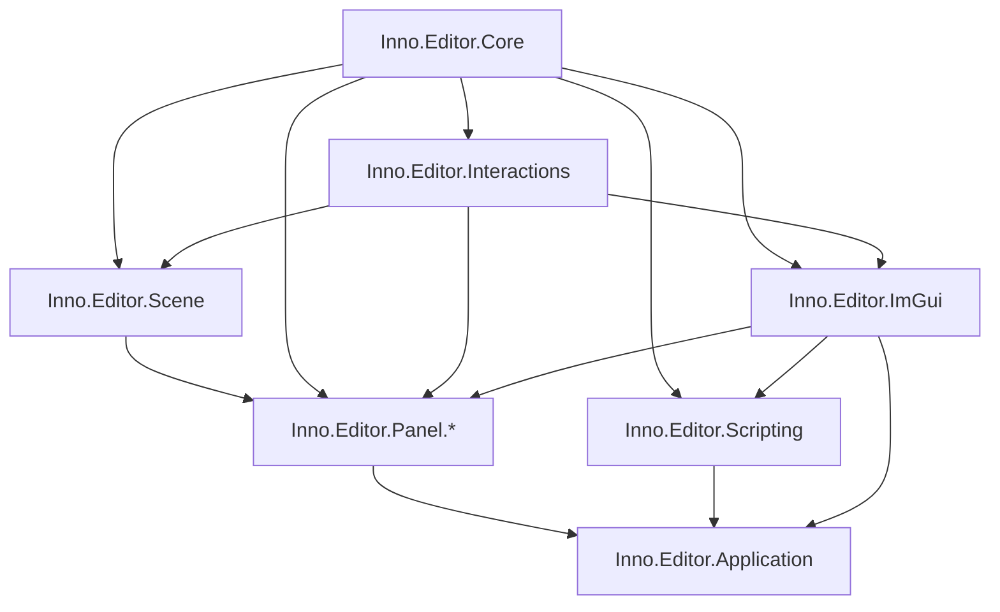

# Editor API

[返回 Wiki 首页](../README.md) · [Core](../core/README.md) · [Assets](../assets/README.md)

Editor 采用“被动核心 → 后端无关交互 → ImGui 表现 → 独立 Panel feature → Application 组合根”的单向分层。Core 与 Interactions 不引用 Assets、Scene 或任何具体 Panel；业务行为由各 Panel 项目通过 Attribute 自发现。

## 项目索引

| 项目 | 职责 |
| --- | --- |
| [Inno.Editor.Core](Inno.Editor.Core.md) | `EditorContext`、frame/runtime、Module、Panel、Modal 与 Workspace provider 的最小契约。 |
| [Inno.Editor.Interactions](Inno.Editor.Interactions.md) | Action、area、menu、shortcut、selection、drag/drop、Undo/Redo、Workspace 存储与扩展代际。 |
| [Inno.Editor.Scene](Inno.Editor.Scene.md) | Scene document workspace、细粒度 Scene 编辑门面与 reload-safe History 协议。 |
| [Inno.Editor.ImGui](Inno.Editor.ImGui.md) | ImGui runtime、renderer、统一 Widget、Palette 与 Style metrics。 |
| [Inno.Editor.Scripting](Inno.Editor.Scripting.md) | Asset-backed Roslyn 编译、facade、IDE 工程与热重载。 |
| [Inno.Editor.Panel.FileBrowser](Inno.Editor.Panel.FileBrowser.md) | AssetEditor、文件浏览、Asset 操作与 Asset-side drag/drop。 |
| [Inno.Editor.Panel.Hierarchy](Inno.Editor.Panel.Hierarchy.md) | Scene workspace、Hierarchy、Scene/GameObject 操作与排序。 |
| [Inno.Editor.Panel.Inspector](Inno.Editor.Panel.Inspector.md) | Inspector/Property Drawer 与 Component/System 操作。 |
| [Inno.Editor.Panel.Logging](Inno.Editor.Panel.Logging.md) | Editor 日志/诊断缓冲与 Console Panel。 |
| [Inno.Editor.Panel.Stats](Inno.Editor.Panel.Stats.md) | 平滑后的帧统计与 Stats Panel。 |
| [Inno.Editor.Application](Inno.Editor.Application.md) | Platform、Shell、ImGui 和全部 feature 的组合根。 |

## 依赖方向

箭头表示基础能力流向使用者。五个 Panel project 彼此不引用；跨面板操作只传递共享领域类型，例如 `AssetFileEntry`、`AssetInfo`、`GameScene` 和 `GameObject`。

## 源码与依赖约定

- 每个 Editor 项目的源码统一使用项目名作为物理 namespace；功能目录不产生子 namespace。例如 Inspector 的 `Commands`、`PropertyDrawing` 与 `Presentation` 都使用 `Inno.Editor.Panel.Inspector`。
- 唯一例外是 `Inno.Editor.ImGui/Widgets`，其 namespace 固定为 `Inno.Editor.ImGui.ImGuiWidget`，且目录中只允许 `ImGuiWidget.*.cs`。
- 目录按功能命名，不使用 `Internal` 目录表达访问级别。
- 每个 Editor `.csproj` 的第一个 ProjectReference `ItemGroup` 保存实现依赖并设置 `PrivateAssets="compile"`；第二个分组只保留真正出现在 public/protected API 中的传递依赖。

## 扩展入口

- 新 Panel：继承 `EditorPanel` 并添加 `[EditorPanel]`。
- 新操作：继承 `EditorAction` 或 `EditorAction<TTarget>` 并添加 `[EditorAction]`。
- 右键或主菜单：在 Action 上添加任意层级的 `[EditorMenu(area, "A/B/C")]`。
- 动态菜单：继承 `EditorMenuSource` 并添加 `[EditorMenuSource(area)]`。
- 拖放：继承 `EditorDrop<TSource,TTarget>` 并添加 `[EditorDrop(area)]`。
- 选择、焦点和打开等交互：通过 `interactions.For(area, target)` 获取轻量 `EditorInteraction`。
- 可撤销操作：领域 Module 先完成修改，再用中立 `EditorHistoryChange` 与 `[EditorHistoryHandler]` 记录；连续值可设置稳定 `mergeKey`，复合修改使用 transaction。
- 项目语义状态：Module/Panel 实现 `IEditorWorkspaceState`，无需注册即可自动保存和恢复。

具体例子见 [Interactions](Inno.Editor.Interactions.md) 与各 Panel 页面。EditorScripts 必须显式 `using InnoEditor.*;`；项目完全禁止 global using。
