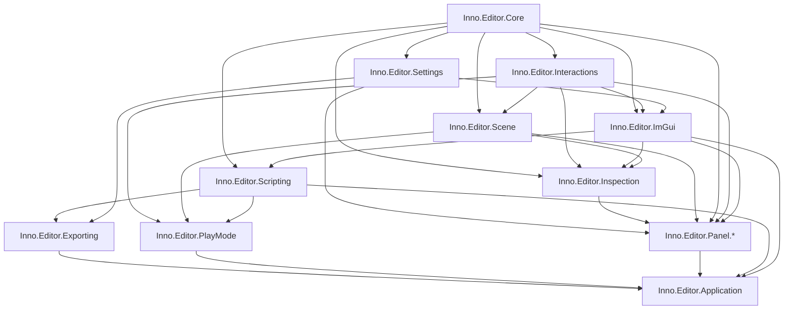

# Editor API

[返回 Wiki 首页](../README.md) · [Core](../core/README.md) · [Assets](../assets/README.md)

Editor 采用“被动核心 → 后端无关交互 → ImGui 表现 → 独立 Panel feature → Application 组合根”的单向分层。Core 与 Interactions 不引用 Assets、Scene 或任何具体 Panel；业务行为由各 Panel 项目通过 Attribute 自发现。

## 项目索引

| 项目 | 职责 |
| --- | --- |
| [Inno.Editor.Core](Inno.Editor.Core.md) | `EditorContext`、frame/runtime、Module、Panel、Modal 与可选状态 hooks 的最小契约。 |
| [Inno.Editor.Interactions](Inno.Editor.Interactions.md) | Action、area、menu、shortcut、selection、drag/drop、Undo/Redo、Module/Panel 状态存储与扩展代际。 |
| [Inno.Editor.PlayMode](Inno.Editor.PlayMode.md) | 脚本门禁、Scene/History 隔离、游戏循环与 Play/Edit 原子切换。 |
| [Inno.Editor.Scene](Inno.Editor.Scene.md) | Scene document workspace、细粒度 Scene 编辑门面与 reload-safe History 协议。 |
| [Inno.Editor.Settings](Inno.Editor.Settings.md) | Editor 结构化值与强类型 Project Setting Drawer 的统一 frontend 协议。 |
| [Inno.Editor.ImGui](Inno.Editor.ImGui.md) | ImGui runtime、pointer-free 脚本 facade、统一 Widget、Palette 与 Style metrics。 |
| [Inno.Editor.Graph](Inno.Editor.Graph.md) | 后端无关 Graph document controller、画布状态、复制粘贴与中立 History。 |
| [Inno.Editor.Rendering](Inno.Editor.Rendering.md) | Plugin viewport provider、通用 RenderRequest、RenderTexture 输出与 opaque ImGui texture 桥接。 |
| [Inno.Editor.Inspection](Inno.Editor.Inspection.md) | InspectionDrawer、PropertyDrawer、Registry 与 serialized property renderer。 |
| [Inno.Editor.Scripting](Inno.Editor.Scripting.md) | Asset-backed Roslyn 编译、facade、IDE 工程与热重载。 |
| [Inno.Editor.Exporting](Inno.Editor.Exporting.md) | File 菜单 Plugin/Game 导出、编译门禁、平台 Player 发布与原子输出。 |
| [Inno.Editor.Panel.FileBrowser](Inno.Editor.Panel.FileBrowser.md) | AssetEditor、文件浏览、Asset 操作与 Asset-side drag/drop。 |
| [Inno.Editor.Panel.Global](Inno.Editor.Panel.Global.md) | internal 全局 Action、Editor/Appearance 页面、Icon 与 Zoom setting definitions。 |
| [Inno.Editor.Panel.Hierarchy](Inno.Editor.Panel.Hierarchy.md) | Scene workspace、Hierarchy、Scene/GameObject 操作与排序。 |
| [Inno.Editor.Panel.Inspector](Inno.Editor.Panel.Inspector.md) | Inspector Panel、Scene Drawer 与 Component/System 操作。 |
| [Inno.Editor.Panel.Logging](Inno.Editor.Panel.Logging.md) | Editor 日志/诊断缓冲与 Console Panel。 |
| [Inno.Editor.Panel.Settings](Inno.Editor.Panel.Settings.md) | 可缩放阻塞 Modal、可搜索 Page Tree、overview 与 Section field frontend。 |
| [Inno.Editor.Panel.Stats](Inno.Editor.Panel.Stats.md) | 平滑后的帧统计与 Stats Panel。 |
| [Inno.Editor.Panel.SceneView](Inno.Editor.Panel.SceneView.md) | 不含 Camera/Picking 假设的 Plugin 驱动 Scene viewport host。 |
| [Inno.Editor.Panel.GameView](Inno.Editor.Panel.GameView.md) | 不含运行时世界观的 Plugin 驱动 Game viewport host。 |
| [Inno.Editor.Panel.ShaderGraph](Inno.Editor.Panel.ShaderGraph.md) | ShaderGraph 画布、编辑、预览、诊断与状态恢复。 |
| [Inno.Editor.Application](Inno.Editor.Application.md) | Platform、EngineHost/Edit Session、Build、ImGui 和全部 feature 的组合根。 |

## 依赖方向

箭头表示基础能力流向使用者。各 Panel/feature project 不通过具体 Panel 类型互相耦合；跨功能操作只传递共享领域类型或注入基础服务，例如 `AssetFileEntry`、`AssetInfo`、`GameScene`、`GameObject` 和 `EditorSettings`。

## 源码与依赖约定

- 每个 Editor 项目的源码统一使用项目名作为物理 namespace；功能目录不产生子 namespace。例如 `Inno.Editor.Inspection/PropertyDrawing` 中的类型仍使用 `Inno.Editor.Inspection`。
- 项目内部目录按可独立理解的 feature 聚合。Action、Menu、Drop 等同一业务交互可以共同位于 `Interactions`；只有规模和边界都足够明确的 History、Compilation、Widgets 等子系统才单独分层。禁止以访问级别创建 `Internal`，也避免为单个普通实现文件保留机械式目录。
- 唯一例外是 `Inno.Editor.ImGui/Widgets`，其 namespace 固定为 `Inno.Editor.ImGui.ImGuiWidget`，且目录中只允许 `ImGuiWidget.*.cs`。
- 目录按功能命名，不使用 `Internal` 目录表达访问级别。
- 每个 Editor `.csproj` 的第一个 ProjectReference `ItemGroup` 保存实现依赖并设置 `PrivateAssets="compile"`；第二个分组只保留真正出现在 public/protected API 中的传递依赖。

## 扩展入口

- 新 Panel：继承 `EditorPanel` 并添加 `[EditorPanel]`。
- 新操作：继承 `EditorAction`、`EditorAction<TTarget>` 或 `EditorAction<TTarget,TArgument>` 并添加 `[EditorAction]`；Attribute 与运行时调用都使用项目根目录 `*InteractionIds` 中的 `const string`。
- 右键或主菜单：在 Action 上添加任意层级的 `[EditorMenu(area, "A/B/C")]`。
- 紧凑工具栏：在 targetless Action 上添加 `[EditorToolbarItem(area, icon, tooltip)]`；同一 Action 的 `Query` 同时控制 icon、enabled、checked 与动态 tooltip。
- 动态菜单：继承 `EditorMenuSource` 并添加 `[EditorMenuSource(area)]`。
- 拖放：继承 `EditorDrop<TSource,TTarget>` 并添加 `[EditorDrop(area)]`。
- 选择、焦点和打开等交互：通过 `interactions.For(areaId, target)` 获取轻量 `EditorInteraction`，其中 `areaId` 是非空 `string`。
- 可撤销操作：领域 Module 先完成修改，再用中立 `EditorHistoryChange` 与 `[EditorHistoryHandler]` 记录；连续值可设置稳定 `mergeKey`，复合修改使用 transaction。
- 项目语义状态：Module/Panel 使用 Attribute 的唯一 ID，并 override protected `Capture(EditorState)` / `Restore(EditorState)`；扩展只使用 `state.Get` / `state.Set`，未 override Capture 的类型完全不进入状态 IO。
- Editor 用户配置：声明 `[EditorSettingPath("A/B/Field")]` 并继承 `EditorSetting`；字段使用 `EditorSettingObject`，业务通过完整路径读取。Plugin/runtime 的项目协议设置才使用 `Inno.Core.Settings`。
- 新检查器：业务项目引用 `Inno.Editor.Inspection`，继承 `InspectionDrawer<TTarget>` 或实现 `IPropertyDrawer` 并添加对应 Attribute；无需引用 Inspector Panel。

具体例子见 [Interactions](Inno.Editor.Interactions.md) 与各 Panel 页面。EditorScripts 必须显式 `using InnoEditor.*;`；项目完全禁止 global using。
