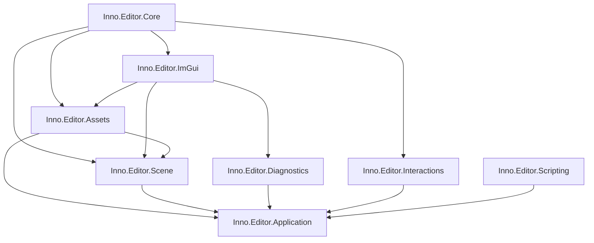

# Editor API

[返回 Wiki 首页](../README.md) · [Core](../core/README.md) · [Assets](../assets/README.md)

Editor 按“中立契约 → 通用交互运行时 → 领域 feature → Application 组合根”分层。Core 与 Interactions 不引用 Scene、Assets 或 Diagnostics，领域类型只存在于对应 feature project。

| 项目 | 作用 | 状态 |
| --- | --- | --- |
| [Inno.Editor.Core](Inno.Editor.Core.md) | Module/Action/Menu/Drop/Panel/Selection 公共契约 | 已完成 |
| [Inno.Editor.Interactions](Inno.Editor.Interactions.md) | 单一 TypeCache Catalog、constructor injection、router 与 runtime | 已完成 |
| [Inno.Editor.Assets](Inno.Editor.Assets.md) | AssetEditor、File Browser、Asset action/menu/drop | 已完成 |
| [Inno.Editor.Scene](Inno.Editor.Scene.md) | Scene Workspace、Hierarchy、Inspection、Scene action/menu/drop | 已完成 |
| [Inno.Editor.Diagnostics](Inno.Editor.Diagnostics.md) | Diagnostics Module、Logging 与 Stats | 已完成 |
| [Inno.Editor.Application](Inno.Editor.Application.md) | Editor 可执行入口、project directory 与主循环 | 已完成 |
| [Inno.Editor.Scripting](Inno.Editor.Scripting.md) | Asset-backed Roslyn 编译、IDE facade 与程序集热重载 | 已完成 |
| [Inno.Editor.ImGui](Inno.Editor.ImGui.md) | 菜单/拖放渲染桥、统一 Widget、Palette 与 Style metrics | 已完成 |

箭头表示基础能力流向使用者，与 `.csproj` 中“使用者引用基础项目”的书写方向相反。`Inno.Editor.Scene` 可以提供 SceneAsset/Prefab 与 Asset Browser 的集成；通用 `Inno.Editor.Assets` 不知道 GameScene/GameObject。
