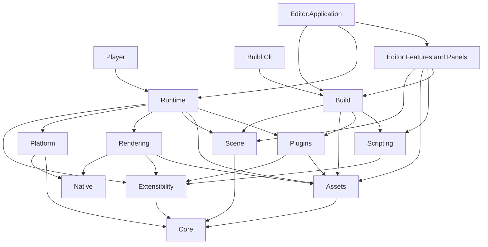

# InnoEngine 全仓架构重构方案（修订版）

[Issues 索引](README.md) · [全量问题台账](2026-08-31-complete-issue-register.md) · [Build 与分层决策](2026-08-31-build-boundary-and-layering-decisions.md)

本文完整保存 2026-08-31 修订后的全仓重构目标。它是最终结构规格，不是旧实现迁移指南；实施状态和关闭证据只记录在[全量问题台账](2026-08-31-complete-issue-register.md)。

## 一、不可违反的架构原则

### 1. 完全禁止 Legacy 与兼容迁移

本次重构以当前源码、当前 Project 数据和最终目标架构为唯一真相。

彻底禁止：

- `Legacy`、`Compatibility`、`Migration`、`Former`、`Deprecated` 目录或文件。
- 旧 namespace façade。
- 旧类型转发。
- 旧 overload。
- `[Obsolete]` 兼容包装。
- 旧格式 fallback reader。
- 新旧格式双写。
- 旧字段别名。
- `schemaVersion`、`formatVersion`、`formerVersion` 等兼容字段。
- “先保留以后再删”的过渡 API。
- 针对旧 API 或旧数据的迁移测试。
- 因为现有调用方较多而保留设计不合理的 API。

发生重构时：

1. 直接设计最终 API。
2. 同步修改全部调用方。
3. 同步更新当前 InnoProject 数据。
4. 当前派生缓存直接重新生成。
5. 删除旧类型、旧项目、旧文件和旧文档。
6. 不允许最终代码中存在任何兼容路径。

这不影响必要的运行时标识，例如 generation、revision、content hash、MVID、job handle generation 和用于拒绝损坏文件的 magic/header。

### 2. API 清晰度高于现有 API 保留

不把“保持当前 API”当作目标。

保留的只能是：

- 本身合理的领域概念。
- 用户明确需要的 Unity 风格易用性。
- Attribute 驱动扩展发现。
- Stable ID。
- Candidate validation。
- Atomic generation switch。
- Runtime/Editor 分离。
- Asset Artifact。
- Scripting API 显式导出清单。

现有 API 如果存在以下问题，直接替换：

- 命名不准确。
- 所有权错误。
- 静态全局状态。
- 泄漏实现类型。
- 为跨程序集访问而公开内部细节。
- 需要 friend assembly 才能工作。
- 一个 API 同时承担 UI、流程编排和底层实现。
- 因旧数据或旧调用方而存在。

### 3. 最小公开原则

类型默认使用 `internal`。

只有满足下列至少一项才能成为 `public`：

1. 正式脚本 API。
2. Plugin 或 Project Script 的真实扩展点。
3. 两个独立生产程序集之间不可避免的稳定协议。
4. Editor、Player、CLI 使用的 Composition Root 入口。
5. 必须跨 runtime/authoring 部署边界传递的不可变模型。
6. 用户代码需要直接调用的正式领域 API。

`protected` 只用于正式支持外部派生的类型。否则使用组合和 `internal sealed` 实现。

测试需要不能成为公开 API 的理由。

### 4. 跨程序集访问决策顺序

当程序集 A 需要访问程序集 B 的内部实现时，必须按以下顺序处理：

1. 判断该实现是否本来就属于 A，并移动所有权。
2. 判断 A 与 B 是否被人为拆开；如果是，合并程序集。
3. 判断协议是否属于更低层的中立领域；如果是，移动到真正的 owner。
4. 只有确实存在多个独立生产实现或消费者时，才提取最小 public contract。
5. 绝不使用 `InternalsVisibleTo`。
6. 绝不为了测试扩大可见性。
7. 绝不通过反射穿透 private/internal。

## 二、文档与问题台账

首先完整记录本轮和前几轮的全部内容。

新增：

- `docs/issues/2026-08-31-build-boundary-and-layering-decisions.md`
  - 原样保存关于 `Inno.Build.*`、`Inno.Core.Export`、`Inno.Export.*` 的问题与回答。
  - 原样保存对当前前后端分离程度、耦合和整改弊端的分析。
- `docs/issues/2026-08-31-architecture-remediation-master-plan.md`
  - 完整保存本修订版方案。
  - 不使用摘要代替项目图、API、实施和测试内容。
- `docs/issues/2026-08-31-complete-issue-register.md`
  - 统一登记全部问题。
  - 每项包含证据、根因、影响、目标 owner、整改阶段、测试和完成标准。

更新：

- `docs/issues/README.md`
- `docs/README.md`
- `docs/architecture/CURRENT_ISSUES.md`

`docs/issues` 成为唯一正式问题台账，不再维护互相漂移的重复清单。

问题台账必须完整覆盖：

1. Runtime Texture 读取不存在的 Source Mount。
2. Runtime Artifact Bundle 不完整时错误出现过晚。
3. Manifest 被强制要求手写 Converter。
4. Export 从错误工作目录启动 `dotnet`。
5. Persistent Data 未严格使用 Application ID。
6. Play Mode 的 Edit Scene 隔离不足。
7. Renderer 与脚本组件的 `enabled` 语义不统一。
8. Play Runtime 普通日志退出后残留。
9. Console Collapse 分组和布局不均。
10. Player Publisher 依赖引擎源码 checkout。
11. Player 携带编译工具和源内容。
12. Export 缺少组合 generation snapshot。
13. Export 阻塞 Editor 并大量占用内存。
14. 缺少 Build Profile。
15. Plugin 曾依赖 `.iplugin`。
16. Plugin 内嵌依赖闭包不完整。
17. Plugin 主线程高频全目录扫描。
18. 11 处 `InternalsVisibleTo`。
19. 静态 Manager 将进程绑定为单 Session。
20. Serialization 手写 Converter 成本过高。
21. `Shell`、`AssetManager`、`ScriptManager` 巨型职责中心。
22. Observer 异常被吞掉。
23. Scripting 没有 Compilation Ticket。
24. Play 编译和准备状态不透明。
25. 架构规则没有自动执行。
26. Export、Scripting、Logging 前后端杂糅。
27. `Inno.Core.Framework` 所有权错误。
28. `Inno.Platform` 直接泄漏 SDL 实现。
29. Rendering 拆分依靠 friend assembly。
30. 测试非确定性和 Player E2E 缺失。
31. 现有 API 保留可能阻碍正确领域建模。
32. 旧 API/旧格式兼容机制可能重新进入代码。
33. 为减少程序集数量或方便测试而过度公开 API。
34. Attribute 发现如果缺少 generation snapshot，可能保留 collectible 类型或旧委托。

已有优点也必须完整保留，不因整改报告只写负面内容。

## 三、最终项目结构

```text
InnoEngine/
├── native/
│   ├── Inno.Native.LibraryLoading
│   ├── Inno.Native.Sdl3
│   ├── Inno.Native.Bgfx
│   ├── Inno.Native.Bgfx.Tools
│   ├── Inno.Native.ImGui
│   └── Inno.Native.ImGuizmo
│
├── src/
│   ├── core/
│   │   ├── Inno.Core.Diagnostics
│   │   ├── Inno.Core.Logging
│   │   ├── Inno.Core.Mathematics
│   │   ├── Inno.Core.Identity
│   │   ├── Inno.Core.Serialization
│   │   ├── Inno.Core.Serialization.Generators
│   │   ├── Inno.Core.Storage
│   │   ├── Inno.Core.Events
│   │   ├── Inno.Core.Input
│   │   ├── Inno.Core.Jobs
│   │   ├── Inno.Core.Coroutines
│   │   ├── Inno.Core.Graphs
│   │   └── Inno.Core.Settings
│   │
│   ├── extensibility/
│   │   ├── Inno.Extensibility.Types
│   │   └── Inno.Extensibility.Modules
│   │
│   ├── scripting/
│   │   ├── Inno.Scripting.Api
│   │   ├── Inno.Scripting.Compiler
│   │   └── Inno.Scripting.Reload
│   │
│   ├── assets/
│   │   ├── Inno.Assets
│   │   └── Inno.Assets.Pipeline
│   │
│   ├── plugins/
│   │   ├── Inno.Plugins
│   │   └── Inno.Plugins.Authoring
│   │
│   ├── scene/
│   │   ├── Inno.Scene
│   │   └── Inno.Scene.Assets
│   │
│   ├── rendering/
│   │   ├── Inno.Rendering
│   │   ├── Inno.Rendering.Runtime
│   │   ├── Inno.Rendering.Assets
│   │   ├── Inno.Rendering.Bgfx
│   │   ├── Inno.Rendering.Bgfx.ImGui
│   │   ├── Inno.Rendering.ShaderGraph
│   │   └── Inno.Rendering.Scene
│   │
│   ├── platform/
│   │   ├── Inno.Platform
│   │   ├── Inno.Platform.Sdl3
│   │   └── Inno.Platform.Sdl3.ImGui
│   │
│   ├── runtime/
│   │   ├── Inno.Runtime
│   │   └── Inno.Player
│   │
│   └── editor/
│       ├── Inno.Editor.Core
│       ├── Inno.Editor.Interactions
│       ├── Inno.Editor.ImGui
│       ├── Inno.Editor.Diagnostics
│       ├── Inno.Editor.Inspection
│       ├── Inno.Editor.Graph
│       ├── Inno.Editor.Settings
│       ├── Inno.Editor.Scene
│       ├── Inno.Editor.Scripting
│       ├── Inno.Editor.PlayMode
│       ├── Inno.Editor.Rendering
│       ├── Inno.Editor.Exporting
│       ├── Inno.Editor.Panel.*
│       └── Inno.Editor.Application
│
├── build/
│   ├── pipeline/
│   │   ├── Inno.Build
│   │   ├── Inno.Build.Platform.MacOS
│   │   ├── Inno.Build.Platform.Windows
│   │   └── Inno.Build.Cli
│   │
│   ├── support/
│   │   └── Inno.Build.SupportPacks
│   │
│   └── toolchains/
│       ├── Inno.Build.Toolchains
│       ├── Inno.Build.Toolchains.Bgfx
│       ├── Inno.Build.Toolchains.Bgfx.Tools
│       ├── Inno.Build.Toolchains.Sdl3
│       ├── Inno.Build.Toolchains.ImGui
│       └── Inno.Build.Toolchains.ImGuizmo
│
└── tools/
    └── Inno.Tooling.Architecture
```

Build 的 Content、Scripting、Player Composition 和 Plugin Packaging 不机械拆成四个程序集。它们是一个 Build bounded context 内的内部阶段，放在 `Inno.Build` 的功能目录中：

```text
Inno.Build/
├── Game/
├── Plugins/
├── Content/
├── Scripting/
├── Player/
├── Snapshots/
├── Diagnostics/
└── Pipeline/
```

这些阶段默认全部 `internal`，避免为了跨程序集调用而公开 `IBuildStep`、内部 Manifest Builder 或 Staging 协议。

只有真正可替换的平台目标使用 public `IGameBuildTarget`。

## 四、依赖方向



强制规则：

- Core 不引用任何业务领域。
- Native 不引用上层项目。
- Build 不引用 Editor。
- Runtime 不引用 Editor 或 Build。
- Player 不引用 Editor、Build、Compiler、Reload、Assets Pipeline、Plugins Authoring 或 Toolchains。
- Rendering 不反向引用 ShaderGraph、Scene 或 Editor。
- ShaderGraph 自己注册扩展，Rendering 不维护节点名单。
- 只有 BGFX Adapter 可以引用 BGFX Native。
- 只有 SDL3 Adapter 可以引用 SDL3 Native。
- Editor Application 是唯一允许高 fan-out 的 Editor Composition Root。

## 五、Attribute 驱动扩展模型

Attribute 模型属于应当保留并强化的核心架构思想。

继续使用并规范：

- `ScriptingApiExport`
- `ScriptingApiNamespace`
- `ScriptingAttachableType`
- `EditorModule`
- `EditorPanel`
- `EditorAction`
- `AssetImporterExtension`
- `AssetBuildProcessorExtension`
- `EditorHistoryHandler`
- Shader Node、Rendering Feature、Settings Contributor 等稳定扩展 Attribute

工作流程统一为：

```text
Discover attributed type
  → Create neutral descriptor
  → Validate stable ID and scope
  → Build candidate registry snapshot
  → Prepare dependent candidates
  → Commit all snapshots atomically
  → Retire previous generation
```

约束：

- Attribute 只描述声明式 metadata，不包含运行状态。
- Attribute 类型只有在 Plugin 或 Project Script 需要使用时才公开。
- Host-only Attribute 保持 internal。
- Manifest 不重复维护扩展类型名单。
- Registry 不长期保存跨 generation 的 `Type`、实例或 delegate。
- 类型发现只发生在 candidate build，不进入逐帧热路径。
- 重复 Stable ID、错误 domain、非法依赖和不可实例化类型必须在 candidate 阶段失败。
- Candidate 未完整成功前不影响 active generation。
- Registry Snapshot 对读取者不可变。
- Generation 切换只发生在明确安全点。

## 六、公开 API 设计

### Runtime

正式公开：

- `EngineHostBuilder`
- `EngineHost`
- `RuntimeSession`
- `RuntimeSessionOptions`

职责：

- `EngineHost` 持有应用级实例服务。
- `RuntimeSession` 持有 Edit、Play 或 Player Session 状态。
- `EngineHost` 可创建多个隔离 Session。
- Dispose 顺序明确且可重复验证。

其余实现，例如 service registry、startup phases、dispose graph、frame scheduler adapters，默认 internal。

### 静态脚本 API

保留 Unity 风格：

- `Log`
- `Time`
- `Input`
- `SceneManager`
- Asset 查询入口

但这些类：

- 不拥有静态可变状态。
- 只解析当前 `ScriptExecutionContext`。
- 不允许引擎内部使用。
- 无活动 Session 时明确失败。
- 支持多个并行隔离 Session。

### Build

公开最小入口：

- `BuildProfile`
- `BuildTargetId`
- `GameBuildRequest`
- `PluginBuildRequest`
- `BuildProgress`
- `BuildDiagnostic`
- `BuildResult`
- `BuildPipeline`
- `IGameBuildTarget`

保持 internal：

- Content bundle writer。
- Script build stage。
- Snapshot validator。
- Plugin ZIP writer。
- Player composer。
- Staging transaction。
- Platform package layout helper。
- Build stage graph。

### Editor Play Mode

公开：

- `IEditorPlayMode`
- `EditorPlayModeState`
- 必要的异步请求和只读状态

保持 internal：

- Module 实现。
- Scene clone orchestration。
- Toolbar Action。
- Session disposal coordinator。
- 状态转换实现。

测试通过正式的 `IEditorPlayMode` 行为和真实可替换依赖验证，不构造 internal Module。

### Console

`Inno.Editor.Diagnostics` 只公开 Panel 和其他 Editor Feature 必须读取的只读模型：

- `IEditorConsole`
- `EditorConsoleSnapshot`
- `EditorConsoleGroup`
- `PlayLogRetention`

Buffer、fingerprint builder、capacity queue、session cleanup implementation 保持 internal。

## 七、彻底消除静态 Manager

替换关系：

| 当前状态 | 最终实例 owner |
| --- | --- |
| `DiagnosticManager` | `DiagnosticHub` |
| `LogManager` | `LogRouter` |
| `IdentityManager` | `IdentityAllocator` |
| `JobSystemManager` | `JobScheduler` |
| `AssemblyManager` | `ModuleHost` |
| `TypeCacheManager` | `TypeCatalog` |
| `SerializationManager` | `SerializationRegistry` |
| `ProjectSettingsManager` | `ProjectSettingsStore` |
| `AssetManager` | `AssetDatabase` / `AssetPipeline` |
| `PluginManager` | `PluginEnvironment` |
| `SceneManager` 的状态 | `SceneWorld` |

静态脚本门面与这些 Manager 是两个不同概念：

- Manager 全部删除。
- 脚本门面保留易用性。
- 引擎内部使用实例依赖。
- 不为兼容当前调用方保留旧 Manager。

## 八、Serialization

继续遵守统一结构化序列化体系：

- `ISerializable`
- `SerializableProperty`
- `SerializationConverter`
- `SerializationRegistry`

新增 Source Generator：

- 普通封闭 DTO 自动生成 Converter。
- 编译期验证 property key、constructor 和支持类型。
- 生成代码可访问同一 compilation 中的 internal 类型。
- 不要求为了序列化将内部 DTO 改成 public。

显式 Converter 只用于：

- 多态。
- 对象身份。
- 引用图。
- 自定义恢复不变量。
- 特殊二进制布局。
- 外部类型适配。

禁止：

- 为单个 Manifest 建立 JSON 旁路。
- 为旧结构增加 fallback。
- 根据旧字段名称猜测数据。
- 加 schema version。
- 保留旧 Converter 和新 Generator 双路径。

## 九、Assets 与 Plugins

### Assets

`Inno.Assets` 为 Player-safe runtime 层：

- Asset identity。
- Asset reference。
- Catalog snapshot。
- Artifact metadata。
- Runtime reader。
- Runtime asset types。

`Inno.Assets.Pipeline` 为 authoring 层：

- Source Mount。
- Watcher。
- Importer。
- Dependency Graph。
- Artifact Writer。
- Build Processor。
- Incremental import。

这是真实部署边界，因此允许最小的 public Artifact/Catalog 协议。

### Plugins

完全删除：

- `.iplugin`
- `PluginDefinitionAsset`
- 创建 Plugin Definition 的 File Browser Action
- 旧 Plugin Definition importer
- 旧 Manifest fallback
- 旧 package schema
- 任何 Legacy Plugin 文件

Plugin Manifest 自动生成。

Attribute 和 Registry 自动发现具体扩展，不在 Manifest 中维护类型列表。

依赖：

- 默认声明稳定 Plugin ID。
- Editor Setting 控制是否内嵌。
- 内嵌时生成完整、扁平、确定性依赖闭包。
- `.iplugin` 容器流式生成。
- 安装只接受 `.iplugin`；Folder、`.zip` 和其他形态在候选前拒绝。
- 安装内容一律只读。
- 修改通过外部替换触发候选 generation。

## 十、Behavior 与 Play Mode

继承结构：

```text
GameComponent
└── Behavior
    ├── GameBehavior
    ├── SpriteRenderer2D
    ├── CameraComponent
    └── 其他具有 enabled 语义的组件
```

`Behavior` 负责：

- `enabled`
- `isActiveAndEnabled`
- `OnEnable`
- `OnDisable`

`GameBehavior` 额外负责：

- `Awake`
- `Start`
- `Update`
- `FixedUpdate`
- `LateUpdate`
- `OnDestroy`

不为了兼容当前 `GameBehavior` 的全部职责而把 Renderer 加入脚本 Update Runner。

Play Mode 使用独立 Runtime Session：

```text
Edit SceneWorld
      │
      ├── immutable start snapshot
      ▼
Play RuntimeSession + Play SceneWorld
```

Edit Scene 从不作为游戏运行对象，因此退出时只需 Dispose Play Session，而不是把被修改的对象恢复回去。

状态：

- `Editing`
- `Compiling`
- `Preparing`
- `Playing`
- `Stopping`
- `Failed`

Compilation Ticket 保证旧编译结果不能覆盖新请求。

## 十一、Logging 与 Console

日志增加 Session identity，不再通过 Assembly Scope 猜来源。

默认 Play 退出策略：

- 删除 Debug。
- 删除 Info。
- 保留 Warning。
- 保留 Error。
- 保留 Fatal。
- 保留编译和 Play 启动失败诊断。

Setting 可选：

- `WarningsAndErrors`
- `All`
- `None`

Console Collapse：

- 使用全局 fingerprint。
- 不再只合并连续日志。
- Group 按最近 occurrence 排序。
- 展开后保留每次 occurrence。
- 同文案但不同 file/stack 的日志不误合并。
- 固定折叠行高度和右侧 Count 列。

## 十二、Rendering、Platform 与 Native

### Rendering

合并 `Inno.Rendering.Core` 与 `Inno.Rendering`，避免人为边界和 friend assembly。

`Inno.Rendering` 包含：

- 后端中立资源。
- RenderGraph。
- Command Encoder。
- Pipeline。
- Shader IR。
- Render Request。
- Capability。

不包含：

- BGFX 类型。
- SDL 类型。
- Editor。
- Scene 世界观。
- ShaderGraph 节点实现。
- 2D/3D/PBR 固定管线。

`Inno.Rendering.Scene` 承担 Scene 与 Rendering 集成。

### Platform

`Inno.Platform` 只定义后端中立契约。

`Inno.Platform.Sdl3` 承担 SDL3 实现。

SDL enum、pointer 和 window 类型不得出现在上层 public/protected API。

## 十三、Build 与 Player

Build 独立放在 `Inno.Build.*`，不进入 Core，也不使用 Export 作为后端领域名。

流程：

```text
Validate
  → Acquire Combined Snapshot
  → Compile Runtime Scripts
  → Produce Target Artifacts
  → Write Content Packs
  → Compose Player Support Pack
  → Platform Package
  → Verify Dependency Closure
  → Atomic Commit
```

要求：

- 异步。
- 可取消。
- 有进度。
- staging 构建。
- 原子提交。
- 失败无半成品。
- Snapshot generation 一致。
- 不把项目整体读入内存。

Player Support Pack：

- `macos-arm64`
- `windows-x64`

导出游戏时不运行 `dotnet`，不依赖引擎源码 checkout。

Player 不携带：

- Roslyn。
- Editor。
- Build。
- Importers。
- shaderc。
- texturec。
- C# source。
- Shader source。
- 裸 Assets。
- 裸 Plugins。

资源输出：

```text
Content/
├── catalog.inno
├── content-<hash>.pack
└── runtime.manifest
```

Persistent Data 严格使用 Application ID。

## 十四、InternalsVisibleTo 清除原则

删除全仓全部 friend assembly。

每处按真实原因整改：

- Assets Loader/Façade：重新合并所有权。
- Rendering Core/Rendering：合并。
- ShaderGraph/Assets：Importer 留在 ShaderGraph 并使用 Attribute 注册。
- Scene/Scene.Assets：使用最小不可变 Scene Snapshot 协议。
- Rendering Runtime/Editor：提供正式 Runtime Composition API。
- PlayMode Tests：测试 public controller 行为。
- Logging Tests：测试 Editor Diagnostics 正式接口。

如果移除 friend 后需要公开大量成员，视为项目边界仍然错误，必须重新合并或移动类型，而不是接受 API 膨胀。

## 十五、XML Comments

所有手写 public 和可重写 protected API 必须有完整英文 XML。

所有 XML element 必须展开为多行。

禁止：

```csharp
/// <summary>Starts the session.</summary>
/// <inheritdoc />
/// <param name="value">Value.</param>
```

要求：

```csharp
/// <summary>
/// Starts an isolated runtime session.
/// </summary>
/// <param name="options">
/// The validated options used to create the session.
/// </param>
/// <returns>
/// The started session owned by the caller.
/// </returns>
/// <exception cref="InvalidOperationException">
/// Thrown when the host has already been disposed.
/// </exception>
```

不允许使用 `inheritdoc` 逃避完整文档。

全仓强制：

- `CS1572`
- `CS1573`
- `CS1591`
- 非 void 必须有 Returns。
- 重要异常必须有 Exception。
- 每个参数和泛型参数必须记录。
- Summary 必须解释语义，而不是重复名称。

Generated Code 仅通过明确生成标识豁免。

## 十六、自动架构检查

`Inno.Tooling.Architecture` 在本地构建、测试和 CI 中检查：

- 不存在 `InternalsVisibleTo`。
- 不存在 Legacy/Compatibility/Migration/Former/Deprecated 实现。
- 不存在 `[Obsolete]` 兼容 API。
- 不存在旧 namespace façade 和类型转发。
- 不存在 schema/version 兼容字段。
- ProjectReference 符合允许方向。
- 不存在循环引用。
- 不存在 global using 或 ImplicitUsings。
- Player closure 不含 forbidden assemblies。
- Native 类型不泄漏。
- public/protected XML 完整且为多行。
- 测试不存在反射穿透和测试专用生产 API。
- Editor/Build/Runtime 边界正确。
- Engine 内部不调用脚本静态门面。
- Attribute Registry 不保留旧 generation 的 runtime 类型或委托。

## 十七、实施阶段

### 阶段 0：完整文档和基线

- 写入全部 `docs/issues`。
- 保存现有 dependency graph、API 清单和测试基线。
- 保护当前未提交修改，不 reset、不覆盖。

### 阶段 1：Core、XML 与 Serialization

- 重命名 Diagnostics、Jobs、LibraryLoading。
- 建立实例基础服务。
- 完成 Serialization Generator。
- 全仓补齐多行 XML。
- 删除 XML warning suppression。

### 阶段 2：Extensibility 与 Scripting

- 重组 Assemblies/Reflection。
- 分离 Scripting API、Compiler、Reload。
- 实现 Compilation Ticket。
- 保留并统一 Attribute Registry 模型。

### 阶段 3：Assets 与 Plugins

- 重组 runtime Assets 与 authoring Pipeline。
- 删除 `.iplugin` 和 Definition Asset。
- 实现只读 Plugin Mount、依赖闭包和确定性 ZIP。
- 清除对应 friend assembly。

### 阶段 4：Scene、Behavior、Play 与 Console

- 引入 `Behavior`。
- 重组 Renderer enabled 语义。
- Play Mode 改为独立 Runtime Session。
- 实现 Session 日志策略和全局 Collapse。

### 阶段 5：Rendering 与 Platform

- 合并 Rendering/Core。
- 分离 Platform/Sdl3。
- 重组 BGFX、ImGui、ShaderGraph、Rendering.Scene。
- 清除所有 Native 泄漏。

### 阶段 6：Runtime、Build 与 Player

- 用 `EngineHost`/`RuntimeSession` 替换 `Shell`。
- 实现 Build Pipeline、Profile、Snapshot、Content Pack 和 Support Pack。
- Game Export 不再调用 `dotnet`。

### 阶段 7：Editor 前后端清理

- Exporting 只保留 UI。
- Scripting 只保留 Editor workflow。
- Diagnostics 后端离开 Panel。
- Editor Application 成为唯一 Composition Root。

### 阶段 8：删除旧结构并锁定规则

- 删除所有旧项目、旧 namespace、旧 API、旧文件和旧测试。
- 不保留兼容包装。
- 更新当前 Project 数据。
- 启用完整 Architecture Check。
- 更新全部 Wiki。
- 运行全量测试和 Player E2E。

## 十八、关键测试

必须覆盖：

- 多 EngineHost 和 RuntimeSession 隔离。
- 静态脚本门面在正确 Session 中解析。
- Host Dispose 后门面失败。
- Attribute candidate 成功、失败、rollback 和 generation unload。
- Stale compilation 永不激活。
- Generated Serialization Converter。
- Runtime 只依靠 Artifact Bundle 加载资源。
- Plugin ZIP/Folder 相同验证。
- 无 `.iplugin` 工作流。
- Plugin 内嵌依赖、循环、冲突和确定性。
- Behavior immediate enable/disable。
- SpriteRenderer 与 GameBehavior 的 Enabled 一致。
- Play 不改变 Edit Scene。
- Play 日志按 Session 清理。
- Console 非连续日志正确聚合。
- Build cancellation 和 atomic output。
- macOS ARM64 Player E2E。
- Windows x64 Player E2E。
- Player dependency closure。
- 无源码、编译器、Toolchain 或 Editor。
- 全仓无 friend assembly。
- 全仓无 Legacy/Compatibility/Migration API。
- 全仓 XML 规则。
- 全仓项目引用规则。

## 十九、最终验收标准

只有同时满足以下条件才算完成：

- `InternalsVisibleTo` 为零。
- Legacy、Migration、Compatibility、Deprecated 实现为零。
- 旧 API façade、转发类型和 fallback reader 为零。
- 不因测试公开任何内部实现。
- Public API 数量经过逐项目审查并保持最小。
- Attribute 驱动发现和原子 generation 成为统一扩展模型。
- 所有真实状态均由实例 owner 持有。
- Player 不依赖源码、`dotnet`、Editor、Build 或 Compiler。
- 游戏资源只以 Artifact Bundle 发布。
- Play 使用独立 Runtime Session。
- Renderer 和 Script 使用统一 Behavior enabled 模型。
- Console Session 清理与全局聚合正确。
- 全部 public/protected API 使用完整多行英文 XML。
- 所有测试、架构检查和两平台 Player 验证通过。
- `docs/issues` 中每个问题都能追踪到实现、测试和关闭证据。

## 二十、2026-09-02 最终生命周期与 Console Settings 决策

本节是对第十、十一、十七、十八和十九节中相关条目的最终架构修订；原文保留用于记录当时方案，当前源码与验收以本节为准。

- 删除公开 `Behavior`，不提供类型转发、别名、旧脚本导出或任何兼容 façade。
- 最终 Component 继承链为 `GameComponent -> GameBehavior`。Renderer、Camera、Light、动画和 Project Script 直接继承 `GameBehavior`，共同获得 enabled 与完整帧生命周期。
- 删除只服务于旧两层结构的 internal activation interface。`GameBehavior` 与本来就单层存在的 `GameSystem` 共同实现一个 host-only `ISceneLifecycleObject`。
- `GameSystem` 不增加 `System` 基类；其语义保持为附加到单个 `GameScene` 的可序列化、有顺序、有生命周期协调对象。
- `GameBehavior.enabled` 与 `GameSystem.enabled` 在 loaded Scene 中都立即协调 `OnEnable`/`OnDisable`。
- `Clear on Play` 的唯一用户配置入口移动到 `Editor/Diagnostics/Console/Clear on Play`，默认 `true`。Console Panel 只保留 Collapse 等布局状态，不保存第二份 retention policy。
