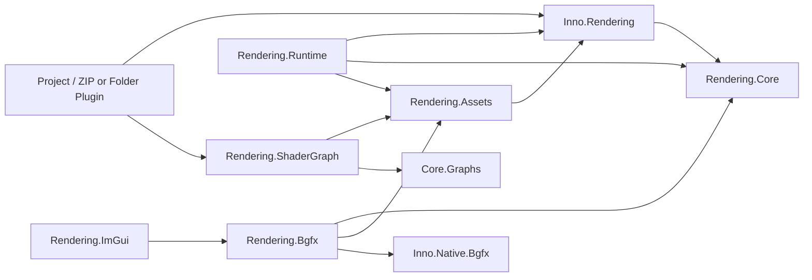

# Rendering API

[返回 Wiki 首页](../README.md) · [Core Graphs](../core/Inno.Core.Graphs.md) · [Plugin](../assets/Inno.Assets.Plugins.md)

Rendering 位于 `src/render`。生产内核是可编程 GPU 基础设施，不包含 2D、3D、PBR、光照、阴影、相机、可渲染组件或固定后处理。项目脚本与 ZIP/Folder Plugin 通过开放协议从零定义世界数据、Shader Contract、Pass Role、Pipeline、Feature、Shader Node 和 Editor Viewport Provider。

> Rendering Core 只提供机制。任何具体渲染策略都必须能在不修改引擎的前提下由项目或 Plugin 完整构建。

## 项目目录

| 项目 | 稳定职责 |
| --- | --- |
| [Inno.Rendering.Core](Inno.Rendering.Core.md) | 后端中立 capability、资源描述、RenderGraph 与命令编码。 |
| [Inno.Rendering](Inno.Rendering.md) | Shader、Technique、Material、Pipeline、Feature、请求与资源服务公开契约。 |
| [Inno.Rendering.Runtime](Inno.Rendering.Runtime.md) | 唯一帧调度、请求队列、扩展 generation、last-good 与 GPU 安全点。 |
| [Inno.Rendering.Assets](Inno.Rendering.Assets.md) | 原生渲染资产、Geometry/Texture 导入、统一 Shader IR 与后端编译契约。 |
| [Inno.Rendering.ShaderGraph](Inno.Rendering.ShaderGraph.md) | 空节点注册表、开放 Program Output、类型检查和统一 IR 前端。 |
| [Inno.Rendering.Bgfx](Inno.Rendering.Bgfx.md) | 唯一允许引用 BGFX 的设备实现。 |
| [Inno.Rendering.ImGui](Inno.Rendering.ImGui.md) | Editor ImGui 的 BGFX GPU 合成，不属于用户 Pipeline。 |

不存在生产 `Inno.Rendering.Pipelines` 项目。具体 Pipeline 应位于 Project Scripts 或 Plugin。

## 依赖方向

`Inno.Rendering.Core` 不引用 Scene、Assets、Editor、ShaderGraph 或 BGFX；`Inno.Rendering` 不引用 Scene 或 ShaderGraph；只有 `Inno.Rendering.Bgfx` 能看到原生 handle、View ID 和 BGFX 枚举。

## 当前验收基线

- 无 Pipeline Plugin 时 Editor 与 ImGui 继续运行，Scene/Game 显示明确的 provider 缺失信息。
- 手写和节点生成 Shader 使用同一 `ShaderIRModule`、验证、shaderc、反射、缓存与 last-good 链。
- 同一 `.sc` 由注入的 `BgfxShadercToolchain` 为 Metal、D3D 或其他 BGFX 后端生成目标产物，不维护平台专用源文件副本；通用 Assets 与 Runtime 不知道 profile。
- RenderGraph、BGFX Noop、原生资产、ShaderGraph、Source Mount 与 ZIP/Folder 安全测试均不依赖任何内建渲染模型。
