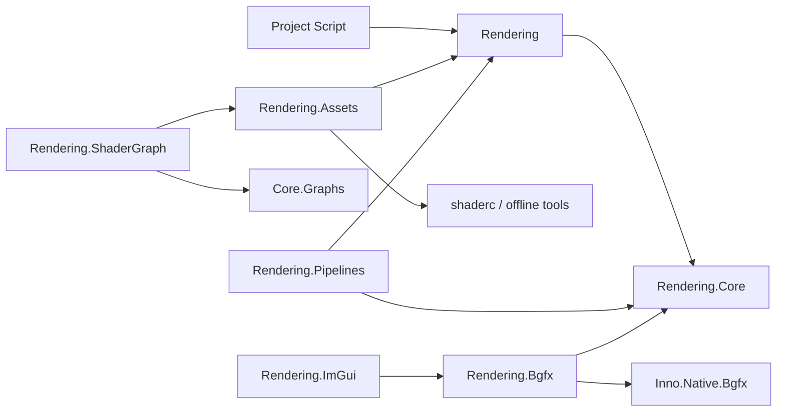

# Rendering API

[返回 Wiki 首页](../README.md) · [前往 Core Graphs](../core/Inno.Core.Graphs.md) · [前往 Engine](../engine/README.md)

Rendering 位于 `src/render`，按“后端中立核心 → 艺术家 API → Pipeline/ShaderGraph → 唯一 BGFX 后端”的单向依赖建设。任何 BGFX handle、View ID、原生指针或枚举都不能离开 `Inno.Rendering.Bgfx`。

## 项目目录

| 项目 | 主要 namespace | 当前状态 |
| --- | --- | --- |
| [Inno.Rendering.Core](Inno.Rendering.Core.md) | `Inno.Rendering.Core` | 已实现设备能力、资源描述、RenderGraph 编译与命令边界 |
| [Inno.Rendering](Inno.Rendering.md) | `Inno.Rendering` | 已实现脚本/艺术家 API、Scene 组件、材质与 Pipeline 扩展契约 |
| [Inno.Rendering.Assets](Inno.Rendering.Assets.md) | `Inno.Rendering.Assets` | 已实现严格 JSON Importer、统一 Shader IR/shaderc、last-good、Texture/Mesh 规范化产物 |
| [Inno.Rendering.Pipelines](Inno.Rendering.Pipelines.md) | `Inno.Rendering.Pipelines` | 已实现 RenderWorld、Forward+/Deferred 生产图、CSM/透明/Bloom/Tone Mapping 与能力降级 |
| [Inno.Rendering.ShaderGraph](Inno.Rendering.ShaderGraph.md) | `Inno.Rendering.ShaderGraph` | 已实现 Surface/VertexFragment/Compute Graph、节点扩展、统一 IR 与节点诊断 |
| [Inno.Rendering.Bgfx](Inno.Rendering.Bgfx.md) | `Inno.Rendering.Bgfx` | 已实现设备、View/Encoder、纹理与安全帧提交的 BGFX 后端垂直切片 |
| [Inno.Rendering.ImGui](Inno.Rendering.ImGui.md) | `Inno.Rendering.ImGui` | 已实现主窗口、detached viewport 与 GPU Texture 的 BGFX ImGui 合成 |

`Inno.Editor.Graph`、`Inno.Editor.Rendering` 及 Scene/Game/ShaderGraph Panel 的入口位于 [Editor 索引](../editor/README.md)。

## 当前依赖边界

`Inno.Rendering.Core` 不引用 Scene、Assets、Editor、Graph 或 BGFX。它公开 generation-scoped handle，所有具体资源创建、View 分配和提交由后端实现。

## 验证与示例

- `.github/workflows/rendering-ci.yml` 在 Windows x64 与 macOS arm64 构建原生依赖、完整解决方案，运行全测试及三帧真实 Editor renderer smoke；本地已完成 macOS Metal 验证，Windows 首次远端结果仍须由 CI 执行。
- `InnoProject/Assets/RenderingShowcase/Showcase.iscene` 是不会覆盖 TestScene 的完整对照场景，包含手写/节点材质、三类光源和阴影接收地面。
- `build/Inno.Build.RenderingShowcase` 可重复导入 Showcase 依赖、生成场景并重新加载验证 Camera、Light、Mesh、Material 引用。
